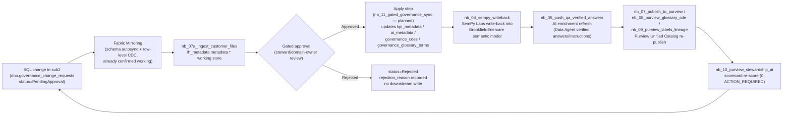
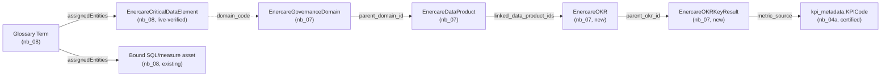

# Enercare Demo — SemPy / SemPy Labs Design Guide

**Purpose:** Capture Alison Pouw's recommended metadata pipeline pattern and translate it into a step-by-step implementation guide for the Enercare demo.

**Source:** Teams thread with Alison Pouw, April–May 2026.

---

## 0. Build Verification Summary (2026-08-07)

This summary reflects the current repo and notebook state after the safety preflight corrections. It uses the prompt's evidence ladder and avoids equating notebook validation rows with live Purview deployment evidence.

| Pillar / milestone | Status | Evidence pointer |
|---|---|---|
| Pillar 1 — self-adapting metadata repository | DRY_RUN_VALIDATED | `nb_07b_merge_customer_metadata`, `nb_04_sempy_writeback`, and `lh_metadata.metadata.*` reconciliation logic are present and wired to re-converge on metadata changes; live publish/read-back has not been re-executed end to end in this pass |
| Pillar 2 — SQL source lineage back to mirrored/semantic/report path | GAP | Custom lineage manifests are present in `nb_09_purview_labels_lineage`, but the live SQL → OneLake → semantic model → report chain has not been proven through a fresh Purview read-back |
| Pillar 3 — AI annotations that travel with the model | DEMO_VALIDATED | `nb_04_sempy_writeback` and `nb_05_push_qa_verified_answers` are the active runtime path, and `docs/runbooks/phase3-step3-runtime-smoke-log.md` shows 5/5 prompt executions passing the expected classes |
| Pillar 4 — Purview governance objects | DRY_RUN_VALIDATED | `purview/*.csv` seed files, `nb_07_publish_to_purview`, and `nb_08_purview_glossary_cde` generate payloads and validation outputs; native Unified Catalog objects are not yet evidenced by a fresh tenant read-back |
| Pillar 5 — governance-as-functional-model / certification loop | DEMO_VALIDATED | Closed 2026-08-10 — all 4 gated scenarios proven live end-to-end via `nb_11_gated_governance_sync`; `nb_10_purview_stewardship_ai` re-confirms 0 `ACTION_REQUIRED` after each apply. See `docs/design-gap-analysis.md` §G14 |
| Milestone M1 — platform registration and scans | DRY_RUN_VALIDATED | SQL + Fabric scan setup and validation notebooks are present; no fresh portal scan export/read-back is stored in repo |
| Milestone M2 — governance foundation and data products | DRY_RUN_VALIDATED | Native Unified Catalog domain/product payloads are prepared from repo sources; supplemental custom Atlas evidence remains separate and is not counted as native deployment |
| Milestone M3 — glossary and CDEs | DRY_RUN_VALIDATED | `nb_08_purview_glossary_cde` writes dry-run artifacts and validation outputs; live glossary/CDE read-back is still pending |
| Milestone M4 — classifications/lineage | DRY_RUN_VALIDATED | `nb_09_purview_labels_lineage` emits classification and lineage manifests; native lineage and MIP label read-back remain pending |
| Milestone M4 — MIP sensitivity labels | GAP | The label policy is prepared in repo, but the pilot semantic model's live label and policy behavior have not been captured from the tenant in this pass |
| Milestone M5 — stewardship, certification, controls, AI readiness | DRY_RUN_VALIDATED | Notebook outputs and scorecards are generated, but the live approval workflow and certification loop are not yet evidenced from the tenant |
| Phase 3 milestone P3-3 | DEMO_VALIDATED | `docs/runbooks/phase3-step3-runtime-smoke-log.md` shows 5/5 prompt executions and PASS for the expected response classes |
| Phase 3 milestone P3-5 | GAP | `P3I-003`, `P3I-005`, and `P3I-006` remain pending live runtime proof and/or governed data binding |
| Phase 3 milestone P3-6 | GAP | The sign-off package is still conditional until the backfit items and native approval evidence are closed |
| Phase 4 (new, §5D) — gated governance & self-healing semantic model sync | DEMO_VALIDATED | Closed 2026-08-10. All 4 gate scenarios (KPI Approval, Verified Answer Certification, CDE Classification, Glossary Term Definition) ran live through `nb_11_gated_governance_sync` and the full downstream chain, closing the Pillar 5 gap. Only G13-5 (scheduled/triggered automation of the downstream chain) remains open, deferred to Phase D |
| G11-1 (new, §5E) — formal ontology / OKR business-objective layer | DEMO_VALIDATED (full graph) | Full ontology graph live-verified end to end (2026-08-10): `nb_08` CDE→Term `assignedEntities` relationship (`cde_term_assigned=12/12`, 26 terms self-healed) AND the OKR/Key Result layer (`sql/11`/`sql/12` applied to `sqldemo`, mirrored, ingested via `nb_07a`, published live to Atlas via `nb_07` — `EnercareOKR`/`EnercareOKRKeyResult` entities confirmed by direct read-back with correct `parent_okr_id` relationships). Fresh `nb_10` re-run confirms `purview_phase_11_ontology_validation` = 0 `ACTION_REQUIRED` (all 4 checks PASS) — see §5E "Live-apply sequence" |
| G17 (new) — unify SQL-controlled and Purview-native governance under one closed-loop ledger | IN_PROGRESS | R1/R2/R3/R5 done live 2026-08-12/13 (legacy migration, GT-SLA reconciliation, AI Instructions gating, role-assignment ledger); R4 (OKR gating) and R6 (prove self-healing for real) remain — see `docs/design-gap-analysis.md` G17 |
| G18 (new, §5G) — source table discovery & governed onboarding (Loop B) | GAP | Design-only since Phase A, never built — `dbo.source_object_inventory`/`dbo.semantic_object_inventory` do not exist, no discovery notebook exists. A new SQL table can reach the semantic model/Data Agent today with zero domain-owner review. See §5G and `docs/design-gap-analysis.md` G18 |
| Phase 5 (new, §5F) — data validation phase / formal QA validation across full northstar metadata inventory | PLANNED | Added 2026-08-09: frozen inventory of ~83 governed elements (3 domains, 3 data products, 35 glossary terms, 12 CDEs, 8 KPIs, 6 verified answers/instructions, 3 OKRs, 5 key results, 3 OKR-links, 4 change requests) and a 5-milestone QA sweep (Q1–Q5) design. No validation code built yet — see §5F |

### Remaining gaps
- Native Purview domain/product/read-back evidence remains pending for the approved demo scope.
- The live lineage chain and MIP sensitivity-label read-back remain pending.
- The live stewardship approval loop has not yet been exercised and read back from the tenant.
- `P3I-003`, `P3I-005`, and `P3I-006` still require live runtime proof or a documented risk acceptance and owner sign-off.

---

## 1. What Alison Is Actually Asking For

Across the thread, Alison is consistently pointing at a **simpler pattern than the one currently scoped in the demo**. Two of her statements are load-bearing:

> "From my understanding they would just need to read the current report metadata using SemPy and then write it using SemPy Labs. To get it to Purview they can just scan the semantic models and get the data to Fabric." — *Alison, 2026-05-18*

> "Not the latter — to scan the SM in Fabric." — *Alison, 2026-05-18 (clarifying that Purview scans the Fabric semantic models, not the SQL-side models)*

In other words: **drop the JDBC-to-SQL / `sys.extended_properties` step from the original design.** Enercare isn't populating `sys.extended_properties` today, so there's nothing to read on that side. The metadata authority becomes the **Fabric semantic model itself**, and Purview is the downstream governance catalog.

This is a meaningful simplification of the earlier flow that included the JDBC bridge.

---

## 2. The Pattern in One Sentence

**SemPy reads current report/model metadata → enrich it in a notebook → SemPy Labs writes it back into the Fabric semantic model → Purview scans the Fabric semantic model → gold-layer data products feed the ontologies that Data Agents sit on top of.**

---

## 3. ASCII Flow

```
                                         ┌──────────────────────────────┐
                                         │  Fabric Lakehouse (Gold)     │
                                         │  - curated tables            │
                                         │  - business metadata staged  │
                                         │    in lh_metadata            │
                                         └──────────────┬───────────────┘
                                                        │ bulk load: table + column defs
                                                        ▼
   ┌──────────────────────────┐    read     ┌──────────────────────────────┐
   │  Existing Power BI       │ ──────────▶ │   Fabric Notebook            │
   │  Semantic Model(s)       │   SemPy     │   - SemPy: read report &     │
   │  (in Fabric workspace)   │             │     model metadata           │
   └──────────────────────────┘             │   - merge with curated       │
              ▲                             │     business metadata        │
              │                             │   - apply descriptions,      │
              │  write back                 │     synonyms, AI instr.,     │
              │  SemPy Labs                 │     verified answers         │
              └─────────────────────────────┤                              │
                                            └──────────────┬───────────────┘
                                                           │ Purview scan
                                                           ▼
                                            ┌──────────────────────────────┐
                                            │  Microsoft Purview           │
                                            │  - catalog & glossary        │
                                            │  - lineage                   │
                                            │  - classification / labels   │
                                            └──────────────┬───────────────┘
                                                           │ published metadata
                                                           ▼
                                            ┌──────────────────────────────┐
                                            │  Gold Data Products          │
                                            │  → Ontologies                │
                                            │  → Data Agents / Copilot     │
                                            └──────────────────────────────┘
```

---

## 4. What Changed From The Original Design

| Original demo step | Status | Reason (per Alison) |
|---|---|---|
| JDBC connection from notebook to mirrored SQL DB | **Remove** | Enercare isn't using `sys.extended_properties`, so there's nothing meaningful to pull. |
| Read `sys.extended_properties` for source metadata | **Remove** | Same — no data there today. |
| SQL Mirror as the metadata source of record | **De-emphasize** | The Fabric semantic model is the runtime metadata surface. SQL Mirror remains for *data*, not metadata. |
| SemPy reads existing Power BI report/model metadata | **Keep — make central** | This is the starting point of Alison's pattern. |
| SemPy Labs writes enriched metadata back to the model | **Keep — make central** | This is the write-back loop she's calling for. |
| Purview scan against **SQL** | **Replace** | Purview scans the **Fabric semantic models**, not SQL. |
| Purview scan against **Fabric semantic models** | **Add** | Confirmed by Alison's "not the latter — to scan the SM in Fabric." |
| Gold layer feeds ontologies → data agents | **Add / make explicit** | From her AI-readiness comments on 2026-05-13. |

---

## 5. Implementation Steps for the Demo

### Step 1 — Stage curated metadata in the Lakehouse (`lh_metadata`)
Keep the existing `lh_metadata` working store. This is the workshop where you assemble:
- Technical metadata (extracted from model + lakehouse)
- Business metadata (KPI definitions, descriptions, glossary terms)
- Stewardship metadata (`owner`, `steward`, `IsDraft`, `IsCertified`)
- AI-facing metadata (AI instructions, verified Q&A)

Bulk-load initial table and column definitions from the lakehouse — this is what Alison meant by *"those definitions can be a bulk load from a lh in fabric like you have."*

### Step 2 — Read current semantic model metadata with SemPy
In a Fabric notebook, use `semantic-link` (SemPy) to read what's already in the Power BI semantic model:

```python
import sempy.fabric as fabric

# Inventory existing model objects
tables   = fabric.list_tables(dataset="EnercareModel")
columns  = fabric.list_columns(dataset="EnercareModel")
measures = fabric.list_measures(dataset="EnercareModel")

# Read existing descriptions/annotations so we don't overwrite curated content
existing = fabric.evaluate_dax(
    dataset="EnercareModel",
    dax_string="EVALUATE INFO.MEASURES()"
)
```

This is the "current report metadata" Alison referenced.

### Step 3 — Merge curated `lh_metadata` with what SemPy read
In the same notebook, join the SemPy-read inventory against your `lh_metadata` tables. Output is a single enriched DataFrame containing, per object:
- Object identity (table / column / measure name)
- Curated business description
- Synonyms
- Owner / steward
- Certification state
- AI instructions and verified-answer references

### Step 4 — Write back to the semantic model with SemPy Labs
Use `sempy-labs` (the extended labs package — `pip install semantic-link-labs`) for the operations SemPy core doesn't cover:

```python
import sempy_labs as labs

# Push descriptions, synonyms, and Prep for AI configurations
labs.set_object_description(dataset="EnercareModel",
                            object_type="Measure",
                            object_name="Net Revenue",
                            description="Revenue after returns and credits...")

labs.set_synonyms(dataset="EnercareModel",
                  object_name="Net Revenue",
                  synonyms=["net sales", "revenue net"])

# Verified answers + AI instructions land via TMDL/Prep-for-AI surfaces
labs.update_tmdl(...)
```

Key point Alison made: this write-back is what makes the metadata real. Curated metadata in `lh_metadata` is useful, but **Copilot and Data Agents read from the semantic model, not from the lakehouse**. The SemPy Labs write step is what gets the work onto the runtime surface.

### Step 5 — Promote and label the model in Fabric
Before scanning, set the Fabric-side governance bits Alison called out as part of "AI-ready":
- Apply **sensitivity labels** to the semantic model
- Mark the model as **Promoted** or **Certified** (endorsement)
- Confirm **DQ rules** are running against the gold tables
- Confirm **medallion** flow: bronze → silver → **gold** (gold is what the model and ontologies should read from)

### Step 6 — Scan the Fabric semantic model with Purview
Register the Fabric tenant in Purview and run a scan against the **semantic models in Fabric** (not against SQL — this was the explicit correction). Purview then becomes:
- The catalog (discoverability across systems)
- The glossary publication target
- The lineage view (model → lakehouse → source)
- The published governance system of record

### Step 7 — Surface gold data products as ontologies for Data Agents
The last leg of Alison's "AI-ready" definition:

> *"leveraging medallion architecture and using the gold layer to feed ontologies which data agents sit on, making sure you have proper sensitivity labels and promoted items in fabric and proper governance and you're running DQ rules."*

In the demo, this means:
- Define one or more **gold data products** built on the curated gold tables
- Treat those as the ontology layer
- Point the **Fabric Data Agent** at the semantic model that sits over them
- The AI Data Schema + AI Instructions + Verified Answers from Step 4 are what give the agent its business context

---

## 5A. Current Notebook Construct (June 2026)

This is the active notebook construct in the repo today.

### Build and source stages

1. `nb_01_setup_demo_environment`
- Seeds the baseline demo tables in `lh_enercare_demo`.

2. `nb_05a_publish_synthetic_data_to_sql`
- Publishes the seven source tables to Azure SQL (`sqldemo`) and then executes SQL scripts `04`-`07` to extend/seed governance metadata in SQL.

3. Fabric mirror sync (operational step)
- Mirrors SQL objects into Fabric mirrored database surfaces (`sqldemo` / `sqldemo-mirror`).

4. `nb_03_pbi_star_schema`
- Rebuilds star schema from mirrored SQL source (or fallback to demo tables if explicitly enabled).

### Metadata and semantic-model stages

5. `nb_02_metadata_pipeline_demo`
- Builds `lh_metadata` metadata tables/views (`asset_metadata`, `column_metadata`, `kpi_metadata`, `vw_business_metadata_current`).

6. `nb_04a_extend_metadata_schema`
- Extends metadata schema (`ai_metadata`, `data_owners`, `lineage_edges`) and seeds curated KPI/AI metadata.

7. `nb_07a_ingest_customer_files`
- SQL-mirror-first ingestion of governance metadata into `lh_metadata.metadata.*`.

8. `nb_07b_merge_customer_metadata`
- Builds `lh_metadata.metadata.sm_annotations` from glossary/CDE/label/data-product mappings.

9. `nb_04_sempy_writeback` and `nb_05_push_qa_verified_answers`
- Writes curated descriptions/annotations/instructions into the semantic model via SemPy/SemPy Labs.

10. `nb_07_publish_to_purview`
- Prepares Purview domain and data-product payloads and is guarded for SQL-mirror-only runs unless explicitly overridden.

11. `nb_08_purview_glossary_cde`
- Publishes Phase 4/5 glossary and CDE payloads from `lh_metadata.metadata.glossary_terms` and `lh_metadata.metadata.cdes`.
- Writes dry-run artifacts to `/lakehouse/default/Files/purview_publish/phase_04_05_glossary_cde` and records validation in `metadata.purview_phase_04_05_validation`.

12. `nb_09_purview_labels_lineage`
- Builds Phase 6/7 sensitivity-classification type definitions, classification manifests, and SQL-to-Fabric lineage edge manifests.
- Writes dry-run artifacts to `/lakehouse/default/Files/purview_publish/phase_06_07_labels_lineage` and records validation in `metadata.purview_phase_06_07_validation`.

13. `nb_10_purview_stewardship_ai`
- Validates Phase 8-10 stewardship, certification, DLP readiness, and governed AI readiness.
- Writes closeout state to `metadata.purview_phase_08_stewardship_scorecard`, `metadata.purview_phase_09_controls_validation`, `metadata.purview_phase_10_ai_readiness_validation`, and `metadata.purview_phase_08_10_closeout`.

### Purview admin-ops family (`nb_06`)

- `nb_06a_create_sin_backstop` is active and intentional.
    - It registers the custom Purview SIT `ENERCARE.PRIVACY.SIN_BACKSTOP` and is part of Day 1 admin setup.

- `nb_06_purview_sql_grants` is not part of the current branch construct.
    - It existed in historical snapshots as a lineage/grants notebook (`CONTROL DATABASE`, `VIEW DATABASE STATE`, fallback principal grants), but was removed in the current design path.
    - This was not migrated as a first-class notebook in current branches.
    - The minimal surviving guidance is now in `nb_05b_test_sql_connectivity` (manual `CREATE USER ... FROM EXTERNAL PROVIDER` and `ALTER ROLE db_datareader ...` hints) plus runbook guidance.

### Why `nb_06_purview_sql_grants` was de-emphasized

- The demo moved to private-safe metadata scanning and custom lineage publication workflows rather than relying on the earlier SQL lineage-grant path as a mandatory runtime step.
- Azure SQL and Purview remain private. Native SQL and Fabric scans own discovery and stable asset identities; custom Atlas processes supplement only missing cross-system edges. Native SQL stored-procedure lineage extraction is optional diagnostics and must not drive a public-network exception. See `docs/closed-loop-governance-reference-model.md`.
- The semantic-model-first writeback and Fabric scan flow remains the primary implementation pattern.

For run-by-run validation of this construct, use `docs/build-evaluation-matrix.md`.

---

## 5B. Azure Purview Delivery Milestones

The open **Enercare Purview Governance Implementation Guide** is treated as the instruction set for the delivery model. The implementation is staged so every milestone has three outputs: a governance decision, a code artifact where applicable, and a validation gate before continuing.

### Milestone 1 — Platform registration and scans

**Governance outcome:** SQL and Fabric are registered in Purview with repeatable scans.

**Code and configuration artifacts:**
- Purview portal/MCP registration for Azure SQL and Fabric tenant/workspace scope.
- Existing SQL/Fabric validation notebooks: `nb_05b_test_sql_connectivity`, `nb_07a_ingest_customer_files`.

**Validation gate:** SQL assets and Fabric workspace assets are searchable in Data Map / Unified Catalog; scan history has no credential or connectivity failures.

**Build & Deploy Status:** DRY_RUN_VALIDATED — repo notebooks and validation artifacts are present, but the live Purview scan/read-back proof is not yet captured in this pass.

### Milestone 2 — Governance foundation and data products

**Governance outcome:** Domains, data products, owners, stewards, and initial product descriptions exist.

**Code artifacts:**
- `sql/06_purview_metadata_schema.sql` creates the SQL-first governance metadata model.
- `sql/07_seed_purview_metadata.sql` seeds baseline domain/product/glossary/CDE/role/label data.
- `nb_07_publish_to_purview` prepares and optionally publishes Purview Atlas entities for domains and data products.

**Validation gate:** `nb_07_publish_to_purview` produces domain/data-product payloads and summary counts; at least three data products are attached to real scanned assets.

**Build & Deploy Status:** DRY_RUN_VALIDATED — repo evidence records the domain/product payload path and the `purview/*.csv` source-of-truth, but native Unified Catalog read-back remains pending. Supplemental custom Atlas evidence remains explicitly separate.

### Milestone 3 — Glossary and critical data elements

**Governance outcome:** Business glossary terms and CDEs are created, linked to domains, and bound to SQL/Fabric/Semantic assets where supported.

**Code artifacts:**
- `purview/glossary-master.csv` and `purview/cde-catalog.csv` remain the customer-facing governance seed files.
- `nb_08_purview_glossary_cde` validates staged metadata, generates Atlas typedefs, creates CDE entities, and prepares glossary term payloads.

**Validation gate:** `metadata.purview_phase_04_05_validation` shows PASS for source rows, glossary payloads, and CDE entities. Dry-run JSON artifacts exist under `Files/purview_publish/phase_04_05_glossary_cde`.

**Build & Deploy Status:** DRY_RUN_VALIDATED — `metadata.purview_phase_04_05_validation` is the validation-gate proof, with the documented dry-run artifact path under `Files/purview_publish/phase_04_05_glossary_cde`.

### Milestone 4 — Classification, sensitivity, and lineage

**Governance outcome:** Sensitive assets have a consistent label/classification model, and the SQL to Fabric to semantic lineage story has a native-or-custom path.

**Code artifacts:**
- `purview/label-policy.csv` defines the sensitivity hierarchy and assignment rules.
- `nb_09_purview_labels_lineage` emits Atlas classification typedefs, classification manifests, and deterministic SQL-to-Fabric lineage edge manifests.

**Validation gate:** `metadata.purview_phase_06_07_validation` shows PASS for classification definitions and assignment manifests. Lineage rows may be WARN until asset GUID resolution or native Purview lineage is available.

**Build & Deploy Status:** DRY_RUN_VALIDATED — `metadata.purview_phase_06_07_validation` is the validation-gate proof, and the lineage work is recorded as a custom Atlas path in `docs/design-gap-analysis.md` G9 closure evidence. Native Purview lineage and MIP-label read-back remain pending.

### Milestone 5 — Stewardship, certification, controls, and AI readiness

**Governance outcome:** Products and critical assets have trust indicators, DLP/control decisions, and AI-facing metadata completeness checks.

**Code artifacts:**
- `nb_07b_merge_customer_metadata` creates the semantic annotation plan from glossary/CDE/label/product mappings.
- `nb_04_sempy_writeback` and `nb_05_push_qa_verified_answers` push governed metadata into the semantic model.
- `nb_10_purview_stewardship_ai` validates owner/steward/certification status, DLP readiness, and AI-readiness prerequisites.

**Validation gate:** `metadata.purview_phase_08_10_closeout` has zero `ACTION_REQUIRED` rows before the governance demo is marked ready. Any DLP mode must be explicitly selected as alert-only, policy tip, or block before a live run.

**Build & Deploy Status:** DRY_RUN_VALIDATED — the repo now emits scorecard/control/AI-readiness validation from `nb_10`, but the live approval-state read-back and native certification loop remain unproven.

### Operating rule for live Purview writes

All Purview notebooks are dry-run first. Live API calls require `APPLY_CHANGES=True` and, where the SQL-mirror-only guard is active, `PURVIEW_PUBLISH_OVERRIDE=True`. This protects the current deployment path while still producing reviewable payloads after every stage.

---

## 5C. Phase 3 — AI Enrichment Design Pattern (Call Center North Star)

### Phase framing

- **Phase 1 (completed):** Infrastructure and architecture.
- **Phase 2 (completed):** Semantic modeling and baseline metadata surfaces.
- **Phase 3 (new):** AI enrichment for call-center outcomes, using Maria Castellanos as the northstar business case.

The objective of Phase 3 is to move from generic annotation coverage to **use-case-valid annotation quality**: KPIs, Verified Answers, and AI Instructions that are explicitly ordered and authored for Tom-style in-call decisions.

### North-star business contract (Maria)

The runtime behavior for this phase is anchored to this minimum scenario:

1. Agent can profile customer state quickly: identity, account, consent, equipment, active service request, contract, billing, and complaint history.
2. Agent can detect and explain SLA breach context for no-heat and missed dispatch.
3. Agent can apply business-rule recommendations in order: immediate operational recovery first, then financial remediation.
4. Agent can issue recommendation for credit where rules are satisfied (for example, SLA breach + active billing during no-heat + not a repeat complainer).
5. Copilot/Data Agent responses remain deterministic by priority ordering and certified metadata state.

### Phase 3 milestones and closure proofs

#### Milestone P3-1 — Source-readiness and coverage review

**Goal:** verify each source domain has enough row-level evidence to support the intended AI annotations.

**Required review scope:**
- Fact tables, dimensions, and production measures in the `BrookfieldEnercare` model.
- Core scenario slices: Customer, Financials (billing/contracts/revenue), Service Records, Equipment, Call History.

**Execution pattern:**
1. Read each row cohort relevant to Maria and adjacent cohorts (non-Maria controls).
2. Map each candidate KPI/VA/AI Instruction to its source columns and measure lineage.
3. Flag unsupported annotation intents as `BACKFIT_REQUIRED`.

**Approval proof to close P3-1:**
- A traceability matrix exists with one row per annotation intent and columns for source support, gaps, and backfit owner.
- No high-priority call-center intent remains unclassified (`SUPPORTED` or `BACKFIT_REQUIRED`).

**Build & Deploy Status:** DEPLOYED — `docs/runbooks/phase3-step1-traceability-matrix.csv` is the live repository proof for source support, gap owner, and backfit classification.

#### Milestone P3-2 — Industry-lexicon KPI design

**Goal:** define KPI semantics in call-center and home-service industry language.

**Design rules:**
1. KPI names and descriptions must be conversant for call-center users (not only technical model terms).
2. KPI definitions must resolve to a single semantic-model measure path.
3. KPI business language must align to glossary terms used in the Maria scenario.

**Approval proof to close P3-2:**
- KPI set is reviewed with domain owner/steward and tagged as `CERTIFIED_FOR_AGENT_USE` in the curation workflow.
- Every KPI used by AI Instructions has a bound measure and glossary linkage.

**Build & Deploy Status:** DEPLOYED — `docs/runbooks/phase3-auto/phase3-step2-kpi-certification.csv` plus the approval summary provide the certification evidence for KPI semantics and stewardship linkage.

#### Milestone P3-3 — Verified Answers pack for call-agent prompts

**Goal:** produce verified answers from actual data states that match high-frequency support intents.

**Priority intents baseline:**
1. `no-heat`
2. `missed appointment` / `no-show`
3. `billing while unresolved outage`
4. `credit eligibility`
5. `repeat complaint risk`

**Design rules:**
1. Verified answers must be derived from data, not only template prose.
2. Each answer must contain explicit condition logic and recommended action path.
3. Sort order must support in-call triage: current customer state before generalized policy text.

**Approval proof to close P3-3:**
- Verified-answer payload is generated and versioned from current metadata tables.
- Smoke prompts in notebook/test harness return expected answer class for all baseline intents.

**Build & Deploy Status:** DEMO_VALIDATED — `docs/runbooks/phase3-step3-runtime-smoke-log.md` records 5/5 prompt executions and PASS for all expected behavior classes in the runtime smoke call-out.

#### Milestone P3-4 — AI Instructions ordering and recommendation policy

**Goal:** enforce deterministic instruction order for call-agent screen needs and recommendation logic.

**Ordering policy (top to bottom):**
1. Identity and customer state snapshot
2. Service urgency and SLA condition
3. Financial exposure (billing/contracts/revenue context)
4. Complaint history and repeat-risk status
5. Recommendation block (actions, credits, escalation)

**Maria decision rule baseline:**
- If active `no-heat` + SLA breach + billing is active during unresolved service window + no repeat-complaint pattern, recommend credit and dispatch escalation.

**Approval proof to close P3-4:**
- Annotation ordering is validated in both draft and published Data Agent surfaces.
- Manual test run for Maria returns policy-aligned recommendation in expected order.

**Build & Deploy Status:** DEPLOYED — `docs/runbooks/phase3-step4-ordering-check.md` and `docs/runbooks/phase3-step4-approval-summary.md` provide the runtime ordering and policy validation proof.

#### Milestone P3-5 — Backfit sprint for annotation-data gaps

**Goal:** close data gaps discovered in P3-1 so AI annotations are fully evidence-backed.

**Backfit scope examples:**
- Missing service-call attributes needed to determine no-show causality.
- Missing complaint recurrence markers for repeat-complaint logic.
- Missing billing-state attributes tied to unresolved outage intervals.

**Approval proof to close P3-5:**
- All `BACKFIT_REQUIRED` items are either implemented or explicitly deferred with owner/date/risk.
- No high-severity annotation remains without data support.

**Build & Deploy Status:** GAP — the backfit notebook and runbook evidence show the implementation work is staged, but the live runtime proof is still pending for `P3I-003`, `P3I-005`, and `P3I-006` in `docs/runbooks/phase3-auto/phase3-step5-backfit-log.csv`.

#### Milestone P3-6 — Phase 3 closeout gate

**Goal:** certify that the call-center AI enrichment pattern is demo-ready and governance-ready.

**Closure checks:**
1. Maria northstar run passes end-to-end for customer profile, service state, financial context, and recommendation output.
2. KPI, Verified Answers, and AI Instructions are traceable to source data and semantic measures.
3. Annotation sort order is stable and deterministic in runtime surfaces.
4. Outstanding gap log contains no unresolved blocking item.

**Approval proof to close P3-6:**
- A short sign-off record is captured with Domain Owner + Data Steward + Demo Owner approval.
- Phase status marked `CLOSED` and promoted as the operating pattern for subsequent scenarios.

**Build & Deploy Status:** GAP — `docs/runbooks/phase3-step6-signoff-record.md` is in `CONDITIONAL_CLOSEOUT_RECOMMENDED` state, which means the validation package is present but the approval/closure gate remains open pending the backfit item decisions.

### Delivery cadence for fast execution

Use short cycles with explicit go/no-go gates:

1. **Cycle 1:** P3-1 and P3-2
2. **Cycle 2:** P3-3 and P3-4
3. **Cycle 3:** P3-5 and P3-6

Each cycle ends with:
- A file gate (only expected assets changed).
- A behavior gate (northstar scenario assertions pass).
- A publish gate (draft/published surfaces synchronized).

This keeps Phase 3 fast while preserving proof-based governance closure.

---

## 5D. Phase 4 — Gated Governance & Self-Healing Semantic Model Sync

**Status:** � Done (closed 2026-08-10; G13-5 scheduling automation deferred to Phase D)
**Depends on:** Phase 3 closure pattern (annotation quality), G10 steward pipeline (fixed 2026-08-08, see `docs/design-gap-analysis.md`)

### Phase framing

- **Phase 1 (completed):** Infrastructure and architecture.
- **Phase 2 (completed):** Semantic modeling and baseline metadata surfaces.
- **Phase 3 (completed):** AI enrichment for call-center outcomes (Maria northstar).
- **Phase 4 (new):** Close the loop. Every prior phase pushed metadata **one direction** — SQL → mirror → lakehouse → semantic model → Purview. Phase 4 makes that loop **circular and gated**: a SQL-side change proposes a metadata change, a named steward/owner approves it in a governance gate, and the approved change writes back into the semantic model and Purview *as a certified fact*, closing back to the SQL-facing dashboards Tom, Victoria, and Ci Zhu already use.

### Why this phase exists

Fabric Mirroring with new-table autosync (enabled this session) solves **schema drift** — new tables/columns land automatically. It does **not** solve **governed value drift** — e.g., a data steward approving a KPI recalibration, certifying a verified answer, reclassifying a CDE's sensitivity, or tightening a glossary term's definition. Those are business decisions that must be **requested, reviewed, and approved** before they're allowed to change what Tom's CRM, Victoria's dashboard, or the Data Agent says — otherwise the single-source-of-truth guarantee in the Maria northstar scenario (`docs/purview-maria-north-star-scenario.md` §3.7: *"it would mean someone edited the semantic-model TMDL ... requires my review"*) is just a narrative claim, not an enforced mechanism.

### The self-healing circular architecture



The loop is genuinely circular: the SQL tables that hold the *request* (`dbo.governance_change_requests`) and the *applied, certified state* (`kpi_metadata.IsCertified`, `governance_cdes.status`, `governance_glossary_terms.status`) are themselves queryable from the same BI/reporting surfaces Victoria and Ci Zhu already use — so "did this change get approved and when" is itself a governed, reportable fact, not a side artifact.

### The gating table: `dbo.governance_change_requests`

Added in `sql/09_gated_governance_requests_schema.sql`. One generic, audit-trailed workflow table serves all four gate types (rather than bolting ad hoc workflow columns onto every target table individually):

| Column | Purpose |
|---|---|
| `request_id` | PK |
| `request_type` | `KPI_APPROVAL` \| `VERIFIED_ANSWER_CERTIFICATION` \| `CDE_CLASSIFICATION` \| `GLOSSARY_TERM_DEFINITION` |
| `domain_id` | Which of the 3 governance domains this touches |
| `target_object_id` | KPICode / `ai_metadata.RecordID` / `cde_id` / `term_code` — NULL if the request creates a brand-new object |
| `proposed_payload` / `previous_payload` | JSON snapshots — proposed new values vs. prior state, for diff and audit |
| `requested_by_upn` / `requested_at` | Who proposed the change and when |
| `status` | `Draft` → `PendingApproval` → `Approved`/`Rejected` → `Applied` |
| `approver_upn` / `approved_at` | Who approved and when |
| `applied_at` | Stamped once the semantic-model/Purview write-back actually completes |

Companion `approved_by`/`approved_at` columns were also added directly to `governance_glossary_terms` (plus `previous_definition`) and `governance_cdes` (`classification_approved_by`/`classification_approved_at`), so the "who certified this" fact is queryable on the live object itself, not only in the request log. `kpi_metadata` already carries certification columns (`IsCertified`, `Version`, `PreviousFormula`, `CertifiedBy`, `CertifiedDate`) from Phase 2 — no change needed there. `ai_metadata` (Lakehouse-only, not SQL-mirrored) needs an equivalent `IsCertified`/`CertifiedBy`/`CertifiedDate` addition — see Milestone P4-2 below.

### The four gate scenarios

Each of the four Maria-northstar stakeholders drives exactly one gate type as requester; Ci Zhu — already the Act 3 governance-admin figure and co-owner of all three domains — is the constant approver, completing the "requires my review" guarantee for real:

| # | Gate type | Object | Requester | Approver | Maria-scenario tie-in |
|---|---|---|---|---|---|
| 1 | **KPI Approval** | `SLA_BRCH_RATE` (v1 → v2) | Ranbir Singh (Domain Owner DOM-SVCDEL) | Ci Zhu | Closes the auto-suppression dispatch bug Ranbir found in Act 2 |
| 2 | **Verified Answer Certification** | New Q&A: "SLA credit policy for a no-heat call" | Rupal Solanki (Data Steward DOM-CUSTOPS) | Ci Zhu | Certifies the exact credit-policy answer Tom gave Maria in Act 1.3 |
| 3 | **CDE Classification** | New `CDE-COMPLAINTREF`, Highly Confidential | Shruthi Srinivas (Data Steward DOM-SVCDEL) | Ci Zhu | Governs the complaint/regulator-case-ref field Tom logged in Act 1.4 |
| 4 | **Glossary Term Definition** | Publish `GT-SLA` (referenced narratively, never registered) | Victoria Tan (Domain Owner DOM-CUSTOPS) | Ci Zhu | Formalizes the SLA definition that drove Victoria's Act 2 fix directive |

Seed data for all 4 (status `PendingApproval`) is in `sql/10_seed_gated_governance_scenarios.sql`. See `docs/runbooks/phase4-gated-governance-workflow.md` for the exact demo-run steps.

### Milestones and closure proofs

#### Milestone P4-1 — Gating schema and demo scenarios
**Goal:** land `dbo.governance_change_requests` plus the 4 seeded scenarios.
**Build & Deploy Status:** 🟢 Done — `sql/09_gated_governance_requests_schema.sql`, `sql/10_seed_gated_governance_scenarios.sql`.

#### Milestone P4-2 — `ai_metadata` certification columns
**Goal:** add `IsCertified` (INT, default 0), `CertifiedBy` (STRING), `CertifiedDate` (DATE) to `lh_metadata.ai_metadata`, mirroring the pattern already on `kpi_metadata`.
**Build & Deploy Status:** � Done — new cell in `nb_04a_extend_metadata_schema`, run live 2026-08-08; confirmed via SQL analytics endpoint that `ai_metadata` now has `IsCertified`/`CertifiedBy`/`CertifiedDate`.

#### Milestone P4-3 — Approval surfacing (demo-operable today)
**Goal:** a demo operator can move any of the 4 seeded requests from `PendingApproval` to `Approved`/`Rejected` via a direct SQL `UPDATE` against `sqldemo` (native Purview workflow-approval APIs remain preview/limited, so the demo models the same state machine on the SQL side, mirrored automatically), and see the row reflect in `lh_metadata.metadata.governance_change_requests` after `nb_07a` runs.
**Build & Deploy Status:** � Partial — depends on P4-1 (done, and confirmed 2026-08-09 to actually be applied live against `sub2`, not just present as repo files) + a manual re-run of `nb_07a_ingest_customer_files` per gate scenario until P4-4 automates it. `nb_07a` extended 2026-08-09 to ingest `governance_change_requests` into `lh_metadata.metadata.governance_change_requests`.

#### Milestone P4-4 — `nb_11_gated_governance_sync` (planned notebook)
**Goal:** a new notebook that reads `Approved`/`applied_at IS NULL` rows from `lh_metadata.metadata.governance_change_requests` and dispatches by `request_type`:
- `KPI_APPROVAL` → update `kpi_metadata` (bump `Version`, set `PreviousFormula`, `CertifiedBy`, `CertifiedDate`, `IsCertified=1`).
- `VERIFIED_ANSWER_CERTIFICATION` → insert/update the row in `ai_metadata` with `IsCertified=1`.
- `CDE_CLASSIFICATION` → insert/update `governance_cdes` (status, `classification_approved_by`/`_at`).
- `GLOSSARY_TERM_DEFINITION` → insert/update `governance_glossary_terms` (definition, `approved_by`/`approved_at`, `previous_definition`).

Then stamps `applied_at = now()`, `status='Applied'`, and prints the downstream chain to run next: `nb_04_sempy_writeback` → `nb_05_push_qa_verified_answers` → `nb_07_publish_to_purview` (+ `nb_08`/`nb_09` as relevant) → `nb_10_purview_stewardship_ai` re-score (full auto-trigger of that chain is scoped to G13-5, deferred).
**Build & Deploy Status:** 🟡 Partial — built and pushed live 2026-08-09 as `fabric/nb_11_gated_governance_sync.Notebook/`; reads directly from the `sub2` SQL source (not the lakehouse mirror copy) to avoid acting on stale Approved status, dispatches all 4 request types, defaults to `DEMO_MODE=True`. Not yet run against a live Approved request — see G14-4..G14-7.

#### Milestone P4-5 — Phase 4 closeout gate
**Goal:** certify all 4 gate types run end-to-end live (SQL request → approval → semantic-model/Purview write-back → scorecard re-confirmation) at least once.
**Closure checks:**
1. Each of the 4 `governance_change_requests` reaches `status='Applied'` with a non-null `applied_at`.
2. `nb_10_purview_stewardship_ai` re-run shows 0 `ACTION_REQUIRED` after each apply.
3. Ci Zhu's Act 3 audit answer (`docs/purview-maria-north-star-scenario.md` §3.7) can be demonstrated live against the newly-certified objects, not just narratively.
**Build & Deploy Status:** � Done — all 4 requests reached `Applied` with non-null `applied_at`; `nb_10` re-confirmed 0 `ACTION_REQUIRED` after each apply (2026-08-10).

---
## 5E. Formal Ontology & B2C Intelligence Surfacing (G11-1 / G11-3)

**Goal:** give Purview a real, traversable relationship graph above the existing Domain → Data Product → Glossary Term → CDE chain, and describe how a future B2C-facing intelligence surface (e.g. a customer chatbot) would query it.

### What "formal ontology" means in this repo

There are two distinct things this repo has called "ontology," and they are not the same:

1. **Informal ontology (already exists):** the shared business vocabulary captured in `context/kpi-definitions.json`, `context/enercare-schemas.json`, and the glossary terms in `governance_glossary_terms` — human-readable definitions with no machine-traversable edges beyond a flat `domain_code`/`parent_term_code` string reference.
2. **Formal ontology (G11-1, this section):** real Atlas entities connected by resolvable relationship attributes that Purview (and any API client, including a future chatbot) can traverse: `EnercareDataProduct` → `EnercareOKR` → `EnercareOKRKeyResult` → certified KPI, and `EnercareCriticalDataElement` → assigned Glossary `Term`.

### The relationship graph, end to end



- **Domain → Data Product**: existing, proven (`parent_domain_id`/`parent_domain_qualified_name` reference attributes, `nb_07`).
- **Data Product → OKR**: new (`linked_data_product_ids`/`linked_data_product_qualified_names` on `EnercareOKR`, `nb_07`), sourced from `governance_okr_data_products`.
- **OKR → Key Result**: new (`parent_okr_id`/`parent_okr_qualified_name` on `EnercareOKRKeyResult`, `nb_07`), sourced from `governance_okr_key_results`.
- **Key Result → KPI**: `metric_source` points at a real `kpi_metadata.KPICode` (or a `BrookfieldEnercare/_Measures/<name>` semantic-measure asset ref where no KPICode exists yet).
- **Glossary Term → CDE**: fixed and live-verified — `nb_08` now assigns each CDE's real Atlas entity to its parent term via `assignedEntities`, not just a flat `glossary_term_code` string. Confirmed live via Atlas read-back: `cde_term_assigned=12/12`, 0 unresolved entities.

This mirrors Purview Unified Catalog's native OKR business concept (Objective + Key Results, tied to a Governance Domain and to "Related data products") on top of the repo's existing Atlas v2 API integration, rather than an unverified separate "native" Data Governance REST API.

### Why this closes a real gap, not a cosmetic one

Before this build, `EnercareCriticalDataElement.glossary_term_code` and `EnercareDataProduct.parent_domain_id` were both flat strings — readable by a human looking at the entity, but not resolvable by Purview's own relationship graph APIs or by any client walking `assignedEntities`. The CDE→Term fix specifically closes that: it was found by code inspection (not assumed), confirming `_assign_term_to_entity()` already existed and worked for `bound_assets` but was never called for the CDEs themselves.

Two distinct bugs had to be fixed and both are now live-verified: (1) `nb_08` was reading the CDE's governing term code from a source column (`glossary_term_code`) that never existed in `lh_metadata.cdes` — the real column is `parent_glossary_term` — so the relationship logic silently no-op'd for every CDE; (2) even after reading the correct column, the term-guid resolution for already-existing terms depended on a `shortDescription` field that had drifted out of sync with the current `term_code` naming convention from an earlier publish session (e.g. `GT-001` vs `GT-CUSTOMER`), which a self-heal GET+PUT now corrects automatically on each run.

### B2C chatbot end-state (G11-3)

The stated end-state is a customer-facing chatbot that can answer questions like *"why was my no-heat service ticket delayed?"* by walking this graph instead of relying on free-text search over documents:

1. Chatbot resolves the customer's service request to `DP-SVCPERF` (Service Performance data product).
2. Walks `DP-SVCPERF` → `OKR-SVCDEL-SLA` (Protect SLA Attainment In Field Service Delivery).
3. Walks the OKR → `KR-SLA-BREACH` (SLA Breach Rate At Or Below Target).
4. Resolves `metric_source = kpi_metadata.SLA_BRCH_RATE` to the certified KPI definition, current value, and threshold (target 5%, warning >10%, critical >15%, per `nb_04a`).
5. Answer is grounded and traceable back to a governed, certified object — not a guess.

**Open questions, deliberately not decided in this session (out of scope for the OKR/ontology build itself):** what the actual customer-facing query surface is (Fabric Data Agent? a separate API?); how a B2C/external identity is scoped and authorized against internal governance objects (today's demo identities are all internal Enercare UPNs); and which fields are safe to expose externally (KPI targets and OKR names likely are; owner UPNs and internal steward assignments likely are not). These need a real security/PII review before any external-facing surface is built — this section documents the grounded target architecture, not an approved external-facing build.

### Live-apply sequence

**All 6 steps are now live-verified end to end (confirmed 2026-08-10)** — the full OKR/ontology layer is live in `sqldemo`, mirrored, ingested, published to Purview, and validated with a fresh `nb_10` run (no dry-run assumptions).

1. ✅ Applied `sql/11_ontology_okr_schema.sql` + `sql/12_seed_ontology_okrs.sql` against `sqldemo` — confirmed live: 3 OKRs (`OKR-CUSTOPS-CX`, `OKR-REVCON-RETAIN`, `OKR-SVCDEL-SLA`, all `status=Published`), 5 key results, 3 OKR→data-product links.
2. ✅ Fabric mirroring confirmed `Replicating` for all 3 `governance_okr*` tables (`getTablesMirroringStatus`, recent `lastSyncDateTime`).
3. ✅ `nb_07a_ingest_customer_files` Cell 8c confirmed landed all 3 tables in `lh_metadata.metadata.*` with matching row counts and correct FK references.
4. ✅ `nb_07_publish_to_purview` confirmed live in Atlas via direct read-back: `EnercareOKR` entities (`OKR-CUSTOPS-CX`, `OKR-REVCON-RETAIN`) and `EnercareOKRKeyResult` entities (`KR-CSAT-SCORE`, `KR-PP-RENEWAL`) resolve by `qualifiedName` with correct `progress_amount`/`goal_amount` and `parent_okr_id`/`parent_okr_qualified_name` relationship attributes.
5. ✅ `nb_08_purview_glossary_cde` (CDE→Term relationship fix) — live-verified: `cde_term_assigned=12/12`, `healed_terms=26`.
6. ✅ Re-ran `nb_10_purview_stewardship_ai` fresh (2026-08-10) — `purview_phase_11_ontology_validation` shows all 4 checks `PASS`, **0 `ACTION_REQUIRED`**: `okrs_available=3`, `okr_key_results_available=5`, `okrs_with_linked_data_product=3`, `key_results_with_resolved_parent_okr=5`.

---
## 5F. Data Validation Phase & Formal QA Validation (Full Northstar Metadata Coverage)

**Status:** 🟡 PLANNED — design only, not yet built. Added 2026-08-09 in response to the risk that prior phases each validated their own slice (Phase 3 smoke prompts, Phase 4 gate scenarios, §5E ontology scorecard) but no single pass confirms **every** metadata element the Maria northstar scenario narratively depends on.
**Depends on:** §5C (Maria northstar contract), §5D (gated governance), §5E (ontology/OKR layer) — this phase validates across all three, it does not add new build surfaces of its own.

### Why this phase exists

Every prior validation pass in this guide is scoped to the phase that built it: P3-3's smoke log only checks the 5 verified-answer intents it produced; the Phase 4 closeout only checks the 4 gate-scenario objects; `purview_phase_11_ontology_validation` only checks OKR/key-result/data-product resolution. None of them, individually or together, confirm that the **full metadata surface the Maria scenario narrates** — every domain, data product, glossary term, CDE, KPI, verified answer, OKR, and change request Tom/Victoria/Ranbir/Rupal/Shruthi/Ci Zhu reference across Acts 1–3 — actually exists, resolves, and is populated end to end. A demo walkthrough that happens to touch an element outside what was already spot-checked has no proof behind it today. This phase closes that by defining one inventory-driven QA pass instead of relying on each phase's local scorecard.

### The northstar metadata element inventory (validation scope)

This is the full, counted inventory of metadata elements the northstar scenario (`docs/purview-maria-north-star-scenario.md`) and its extensions (Phase 4, §5E) reference. Counts are grounded against the current repo source files (`purview/*.csv`, `sql/*`), not estimated.

| Element type | Count | Northstar-referenced examples | Source of truth |
|---|---|---|---|
| Governance Domains | 3 | `DOM-CUSTOPS`, `DOM-SVCDEL`, `DOM-REVCON` | `purview/domain-charter.csv` |
| Data Products | 3 | `DP-CUST360`, `DP-SVCPERF`, `DP-BILLHEALTH` | `purview/data-product-catalog.csv` |
| Glossary Terms | 35 | `GT-CUST`, `GT-ACCOUNT`, `GT-PREMISE`, `GT-FSA`, `GT-CONSENT`, `GT-CASL`, `GT-EQUIP*`, `GT-SVCREQ`, `GT-CONTRACT`, `GT-SLA`, `GT-OCPA`, `GT-COMPLAINT`, `GT-OEB`, `GT-FCR/MTTR/AHT/NPS/REPEATCOMPLAINT/NETREV/CHURN`, `GT-SVCZONE`, `GT-PIPEDA` | `purview/glossary-master.csv` |
| Critical Data Elements | 12 | `CDE-ACCTNUM`, `CDE-SVCADDR`, `CDE-CONSENTSTATE`, `CDE-CONTRACTAMT`, `CDE-COMPLAINTREF` | `purview/cde-catalog.csv` |
| Certified KPIs / measures | 8 | `FCR`, `MTTR`, `AHT`, `NPS`, `RepeatComplaintRate`, `NetRevenue`, `Churn`, `SLA_BRCH_RATE` (added Phase 4) | `context/kpi-definitions.json`, `lh_metadata.kpi_metadata` |
| Verified Answers / AI Instructions | 6 | 5 P3-3 baseline intents (no-heat, no-show, billing-while-unresolved, credit-eligibility, repeat-complaint-risk) + the Phase 4 "SLA credit policy for a no-heat call" VA | `lh_metadata.ai_metadata` |
| OKRs | 3 | `OKR-SVCDEL-SLA`, `OKR-CUSTOPS-CX`, `OKR-REVCON-RETAIN` | `governance_okrs` (`sql/12_seed_ontology_okrs.sql`) |
| Key Results | 5 | includes `KR-SLA-BREACH` | `governance_okr_key_results` |
| OKR → Data Product links | 3 | e.g. `OKR-SVCDEL-SLA` → `DP-SVCPERF` | `governance_okr_data_products` |
| Governance Change Requests (Phase 4 gates) | 4 | KPI Approval, Verified Answer Certification, CDE Classification, Glossary Term Definition | `governance_change_requests` (`sql/10_seed_gated_governance_scenarios.sql`) |
| Sensitivity labels / term-level policies | 4 referenced | `GT-PIPEDA` (consent), `GT-CASL` (marketing consent), `GT-OCPA` (auto-renewal disclosure), `GT-OEB` (regulator complaint) | `purview/label-policy.csv` |

**Total distinct governed elements in scope: ~83** (3 domains + 3 data products + 35 glossary terms + 12 CDEs + 8 KPIs + 6 verified answers/instructions + 3 OKRs + 5 key results + 3 OKR-links + 4 change requests + label policies counted once against their governing term above).

### Validation layers (applied per element, where the layer applies to that element type)

Every element above must be checked at each layer that applies to it — not just "does a row exist somewhere":

1. **SQL source row exists** — the authoritative row is present in `sqldemo` (e.g. `dbo.governance_glossary_terms`, `dbo.governance_cdes`, `dbo.governance_okrs`).
2. **Fabric mirror replication status = `Replicating`** — confirmed via `getTablesMirroringStatus`, not assumed from "mirror all data" being enabled.
3. **`lh_metadata` ingestion row present** — the element landed in `lh_metadata.metadata.*` via `nb_07a_ingest_customer_files`.
4. **Purview Atlas entity published + relationship attributes resolve** — the entity exists via `nb_07`/`nb_08`/`nb_09` and, where the element has a documented graph edge (§5E), that edge (`assignedEntities`, `parent_domain_id`, `linked_data_product_ids`, `parent_okr_id`, `metric_source`) actually resolves to the target entity, not just holds a flat string.
5. **Certification / status flag is correct** — `IsCertified=1` (KPIs, verified answers), `status='Published'` (glossary terms, OKRs), `status='Applied'` (change requests), as appropriate to the element type.
6. **Runtime surface reflects it** — the element is visible/usable where Tom, Victoria, Ranbir, Rupal, Shruthi, or Ci Zhu would actually encounter it in the scenario (Data Agent verified answer, semantic-model measure, CRM-equivalent query, Purview entity page).

Not every element type needs every layer — e.g. sensitivity labels don't have a `lh_metadata` ingestion step — but each element's applicable subset must all pass before that element counts as validated.

### QA milestones

#### Milestone Q1 — Inventory freeze
**Goal:** lock the element inventory table above as the authoritative validation scope, so QA has a fixed target instead of an open-ended "test everything" mandate.
**Approval proof:** inventory table reviewed against `purview/*.csv` row counts and `docs/purview-maria-north-star-scenario.md` element references; counts reconciled (as done above).
**Build & Deploy Status:** 🟡 PLANNED — this design-guide table is the first draft of the frozen inventory; not yet reviewed/signed off by a steward.

#### Milestone Q2 — Automated element-existence sweep
**Goal:** for every element in the inventory, mechanically confirm layers 1–3 (SQL row, mirror status, `lh_metadata` row) exist — no manual spot-checking.
**Design approach:** a new validation cell (proposed `purview_phase_12_northstar_validation`, following the naming pattern of `purview_phase_11_ontology_validation`), likely added to `nb_10_purview_stewardship_ai` or a new `nb_12_northstar_validation` notebook, driven directly off the inventory table so adding a row to the inventory automatically adds it to the sweep.
**Approval proof:** sweep output shows 0 `MISSING` across all in-scope elements, or an explicit, owned exception list.
**Build & Deploy Status:** 🔴 Not started.

#### Milestone Q3 — Cross-layer resolution sweep
**Goal:** confirm layers 4–5 (Purview entity published, relationship attributes resolve, certification/status flags correct) for every element, with particular attention to the graph edges introduced in §5E (`assignedEntities`, `linked_data_product_ids`, `parent_okr_id`, `metric_source`) since those are the newest and least-proven paths.
**Approval proof:** every documented relationship edge in the §5E diagram resolves to a real target entity (not a dangling string), verified via a fresh Purview/Atlas read-back, not repo-side assumption.
**Build & Deploy Status:** 🔴 Not started.

#### Milestone Q4 — Northstar runtime re-walk
**Goal:** re-run the actual Act 1–3 scenario beats (Tom's identity/consent/contract/complaint lookups, Victoria's Act 2 KPI drill, Ci Zhu's Act 3 audit answer) against live runtime surfaces, confirming every element the scenario narrates is not just present in a table but usable in the flow a real user would follow.
**Approval proof:** each Act 1–3 beat produces the expected answer/state live, cross-referenced back to the specific inventory rows it exercises.
**Build & Deploy Status:** 🔴 Not started.

#### Milestone Q5 — QA closeout gate
**Goal:** certify the full northstar metadata surface is demo-safe — any walkthrough path a presenter takes is backed by verified, resolved, certified metadata.
**Approval proof:** a scorecard artifact (proposed `docs/runbooks/northstar-qa-validation-scorecard.md`) records pass/fail per inventory row across all applicable layers, with a Domain Owner + Data Steward + Demo Owner sign-off, mirroring the P3-6 closeout pattern.
**Build & Deploy Status:** 🔴 Not started.

### Relationship to existing scorecards

This phase does not replace `purview_phase_11_ontology_validation`, the Phase 3 smoke log, or the Phase 4 closeout checks — it is the superset pass that consumes their existing evidence for the elements they already cover (OKRs, verified-answer intents, gate-scenario objects) and extends the same rigor to the remaining inventory (domains, data products, glossary terms, CDEs, and KPIs not already covered by a prior phase's scorecard).

---

## 5G. Source Table Discovery & Governed Onboarding (Loop B) — new, not yet built

**Status:** 🔴 Not started (design-only since Phase A; see `docs/design-gap-analysis.md` G18)
**Depends on:** Fabric Mirror new-table autosync (already enabled), Purview SQL/Fabric scans (already working)

### The gap this closes

Mirroring and scanning solve **discovery** — a new SQL table lands in OneLake automatically, and becomes searchable in the catalog on the next scan cycle. Neither one decides whether that table **belongs** in the semantic model or should ever reach the Data Agent's grounding. Today, that decision is unmade — whoever next edits `nb_04`/`nb_04a`/the TMDL just adds a new table, with zero domain-owner or steward review. This is the same governance gap R1-R6 (§ G17) closed for KPIs/CDEs/Verified-Answers/AI-Instructions/OKRs, but one layer down, at the table/column level itself.

### How discovery and governance actually relate

| Mechanism | Scope | Gates semantic-model inclusion? |
|---|---|---|
| Fabric Mirror new-table autosync | Transport: SQL → OneLake | No |
| Purview SQL/Fabric scan | Discovery: makes the table searchable in the catalog | No |
| **Loop B (this phase)** | **Governance: Draft → domain/data-product/sensitivity/semantic-role review → Approved → semantic-model extension** | **Yes** |

### Operating sequence (per `docs/closed-loop-governance-reference-model.md` Loop B)

1. A new regular table is created/altered in private Azure SQL.
2. Fabric Mirroring transports it into OneLake (already automatic today).
3. A discovery notebook compares qualified names/schema hashes against `dbo.source_object_inventory`.
4. A newly observed table is classified: `Ignore` \| `StageOnly` \| `CandidateDimension` \| `CandidateFact` \| `Reference` \| `Governance` \| `Unclassified`.
5. An eligible (non-`Ignore`/`StageOnly`) table opens a `Draft` request in the unified ledger (`request_type='SourceTableOnboarding'`) proposing owner, domain, data product, sensitivity intent, description, key grain, and semantic role.
6. **Only an Approved request is transformed and added to the semantic model** — via SemPy Labs, same as every other governed write-back in this repo.
7. Runtime relationships are validated and receipts return to SQL — same `governance_target_receipts` contract as P1-P4/G17.
8. The resulting governed asset is associated with Purview where supported.

### Build tasks (see `docs/design-gap-analysis.md` G18 for the tracked table)

- `sql/18_source_discovery_schema.sql` — `dbo.source_object_inventory` + `dbo.semantic_object_inventory`.
- `nb_17_source_discovery` — read-only diff notebook; writes inventory rows + `Draft` requests only, never mutates the semantic model.
- An approval step reusing the same pattern already proven for KPI/CDE/AI-Instruction gates.
- An apply step (mirrors `nb_13`/`nb_16`): extend the TMDL only after Approved, then read back and validate.
- Wired directly into the unified `governance_requests`/events/receipts/versions ledger from day one — no legacy-schema migration needed since this is a new workstream.

---
## 6. Layer Responsibilities (Mental Model)

| Layer | Role | Tool |
|---|---|---|
| Source data | Operational data, gold tables | Fabric Lakehouse (medallion) |
| Working metadata store | Curate / extend / certify metadata | `lh_metadata` lakehouse |
| Runtime metadata surface | Where Copilot / Data Agents read from | Fabric semantic model (via SemPy Labs write-back) |
| Governance / publication | Catalog, glossary, lineage, classification | Microsoft Purview (scanning the Fabric SM) |
| AI consumption | Question answering, narrative, action | Fabric Data Agent on top of gold + ontologies |

---

## 7. Things to Validate Before Building

The active repo validates the following items as resolved or still open:

1. **Target semantic model already fixed** — `BrookfieldEnercare` in the current Fabric workspace is the canonical model target; the repo is aligned to that runtime object and not a stand-in.
2. **Purview tenant / subscription choice has been resolved in repo guidance** — the design and gap-analysis docs keep the `sub1` / `sub2` / `sub3` split explicit and the Purview scan path anchored to the Fabric semantic-model plane.
3. **AI Data Schema scope is now bounded to the working semantic model + governed metadata** — the prompt/playbook path answers from the curated Data Agent surface rather than from a separate `.copilot`/skills dependency.
4. **Ontology shape is concrete and demo-ready** — the gold layer and governance-product mapping are represented through the data-product and glossary/CDE pipeline, not a speculative ontology-only design.
5. **Promotion / certification authority is defined in the governance loop** — `status=Published` is the intended gate, but the live native approval/read-back transition remains pending evidence.

Open follow-up items still tracked in the repo:
- Native Purview governance-object read-back remains pending for the approved demo scope.
- The live lineage chain and MIP sensitivity-label read-back remain pending.
- `P3I-003`, `P3I-005`, and `P3I-006` remain pending live runtime proof or a documented risk acceptance and owner sign-off.

---

## 8. References Alison's Pattern Maps To

- *Semantic model best practices for Data Agent* — `learn.microsoft.com/en-us/fabric/data-science/semantic-model-best-practices`
- *Prepare your data for AI in Power BI* — `learn.microsoft.com/en-us/power-bi/create-reports/copilot-prepare-data`
- *Use Microsoft Purview to govern Microsoft Fabric* — `learn.microsoft.com/en-us/purview/microsoft-purview-fabric`
- *Metadata and lineage from Fabric into Microsoft Purview* — `learn.microsoft.com/en-us/purview/how-to-lineage-fabric`
- `semantic-link` (SemPy) — `pypi.org/project/semantic-link/`
- `semantic-link-labs` (SemPy Labs) — `pypi.org/project/semantic-link-labs/`

---

## Appendix — Alison's Comments, Verbatim

**2026-04-15** — Background: Enercare wants SQL → Fabric mirroring with governance parity; Sean expects the conversation to turn to RLS/OLS. (Sean's framing, not Alison's, but sets the stage.)

**2026-05-07 21:10:32** — *"You have a mirror db set up and reading from it with jdbc connection via notebook and adding that to current metadata from reports gotten by sempy and then writing to reports with sempylabs and writing to purview via purview api?"* — initial framing of the pattern.

**2026-05-07 21:12:50** — *"Yeah ideally they have purview as a source but seems like for their UC they need fabric."*

**2026-05-07 21:13:11** — *"Future state would like to have purview cause it's a governance tool."*

**2026-05-13 13:52:45** — *"You can add whatever to the sql db and then scan it. From the last email it seems we can just have table and column definitions to start for the semantic models. Those definitions can be a bulk load from a lh in fabric like you have. Once those are defined then we scan in the fabric semantic models with the appropriate metadata. They can make gold data products and add context to this metadata… AI ready means making sure your data has the most context and good quality so one copy of data, leveraging medallion architecture and using the gold layer to feed ontologies which data agents sit on, making sure you have proper sensitivity labels and promoted items in fabric and proper governance and you're running DQ rules."*

**2026-05-18 17:13:58** — *"But they're not using sys.extended properties rn so what's the point of bringing in that data? From my understanding they would just need to read the current report metadata using SemPy and then write it using SemPy Labs. To get it to Purview they can just scan the semantic models and get the data to Fabric. Does that make sense? The jdbc connection was if they needed the sys extended properties which sounds like they don't and that was my misunderstanding."* — **the simplification.**

**2026-05-18 18:56:07** — *"Not the latter — to scan the SM in Fabric."* — confirming Purview scans the Fabric semantic models, not SQL.
