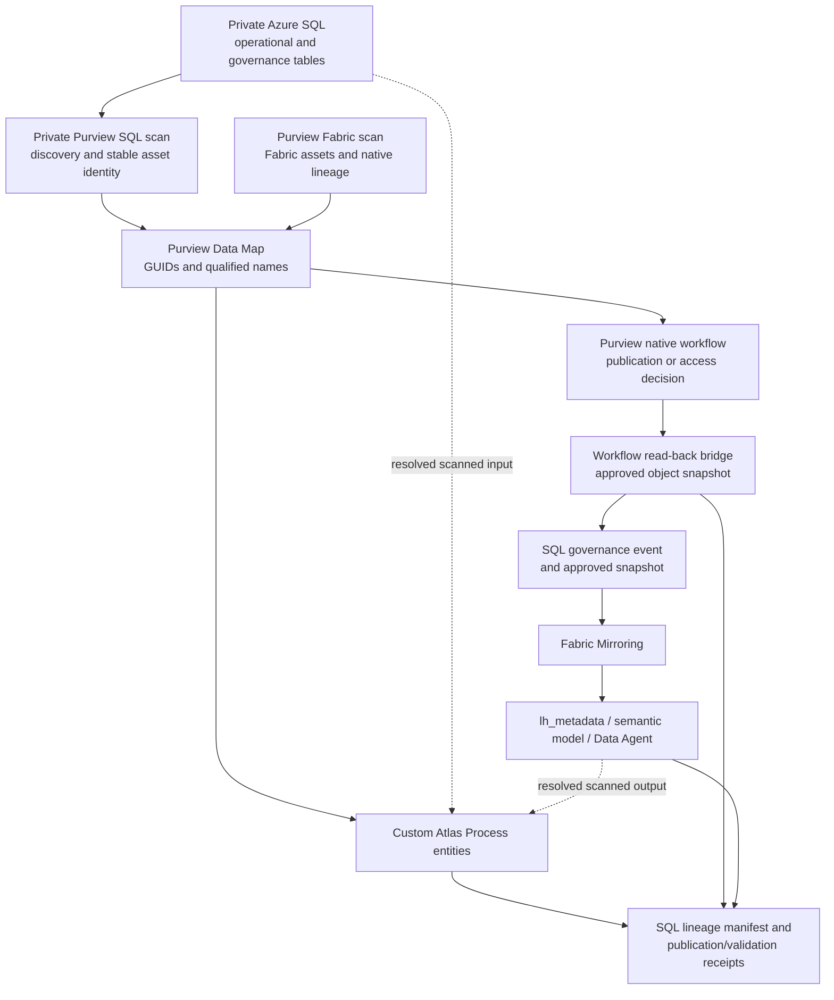

# Closed-Loop Governance Reference Model

## Decision

The Enercare demo uses a private, native-first governance architecture:

- Azure SQL and Microsoft Purview remain private.
- Native Azure SQL and Fabric scans provide asset discovery, classifications where supported, stable asset identities, search, and schema-change detection.
- Purview native workflows are the first approval implementation scope.
- Custom Atlas process entities add only the lineage edges that private native scans cannot observe.
- SQL stores the canonical lineage manifest and publication/validation receipts.
- Native SQL stored-procedure lineage extraction is optional diagnostics, not a dependency or deployment gate.

Do not enable public Azure SQL access to make native stored-procedure lineage extraction work.

## Reference Architecture



Custom lineage must resolve the GUIDs or qualified names of assets produced by native scans. It must not create duplicate stand-in entities for scanned SQL or Fabric assets.

## Responsibility Boundaries

### Native scans

Use native private scans for:

- Azure SQL databases, schemas, tables, columns, and views.
- Fabric lakehouses, mirrored databases, semantic models, reports, and other supported items.
- Classification where supported.
- Stable Purview GUIDs and qualified names.
- Catalog search and discovery.
- Normal schema-change detection.
- Native Fabric lineage that Purview can observe.

### Custom Atlas lineage

Use custom Atlas Process entities for:

- Azure SQL table to Fabric mirrored-table relationships.
- SQL governance table to `lh_metadata` relationships.
- Fabric notebook or transformation to semantic-model relationships not represented natively.
- Governance request to approval, publication, and validation processes.
- Cross-system execution that is not observable inside Azure SQL or Fabric native lineage.

Each custom process edge must be deterministic and idempotent. Its manifest must identify the input and output qualified names, resolved GUIDs, process qualified name, source system, version or payload hash, publication status, and observation timestamp.

### SQL control records

Azure SQL is the canonical propagation and audit record, not the universal approval authority. It stores:

- Normalized governance events from supported approval authorities.
- Approved object snapshots needed downstream.
- The canonical custom-lineage manifest.
- Publication and validation receipts.
- Correlation IDs, versions, payload hashes, timestamps, and errors.

`lh_metadata` is a working propagation and reconciliation store. It is not the authoritative approval log and must not be the only location of workflow evidence.

## Two-Loop Operating Model

The initial design is not a universal governance engine. It has two bounded loops that share a normalized SQL ledger and receipt contract.

### Loop A: Purview approval and semantic reconciliation

1. Create a correlation record in SQL for one supported Purview object.
2. Create or revise the draft object in Purview.
3. A human approves or rejects it through the native Purview workflow.
4. A scheduled Fabric bridge reads the post-decision Purview object and available workflow evidence.
5. The bridge appends the normalized decision and approved object version to SQL.
6. Fabric applies only the required semantic-model delta through SemPy Labs/TOM.
7. The semantic model and Purview object are read back and validated.
8. SQL transitions the request to `Completed` only after all required receipts pass.

The exact supported Purview endpoint and decision fields remain a required technical spike. Assume polling/read-back, not a webhook, until a durable callback is proven.

### Loop B: SQL source discovery and governed onboarding

1. Create or alter a supported regular table in private Azure SQL.
2. Fabric Mirroring transports the table into OneLake.
3. Source discovery compares qualified names and schema hashes with the SQL source-object inventory.
4. A newly observed table is classified as ignore, stage only, candidate dimension, candidate fact, reference, or governance table.
5. Eligible objects create a governance design request with owner, domain, data product, sensitivity intent, description, key grain, and semantic role.
6. Only an approved design is transformed and added to the semantic model.
7. Runtime behavior and relationships are validated, and receipts return to SQL.
8. Resulting governed assets are associated with Purview where supported.

Mirroring is transport and discovery evidence, not approval. Inventory first, govern second, model third. Azure SQL views require a separate materialization, pipeline, or semantic-definition path because they are not mirrored as regular tables.

## Native-First Delivery Scope

### Phase 1: Purview native workflows

Start with exactly one native publication gate: glossary-term publication or data-product publication. Do not require both publication types or data-product access for the first closeout.

For the selected scenario:

1. Create or revise the governed object in Purview.
2. Submit the native Purview workflow.
3. Capture the native approval or rejection.
4. Read back the published object and available workflow evidence.
5. Normalize the outcome into the SQL governance-event contract with an idempotent upsert.
6. Allow Fabric Mirroring to carry the exact SQL event into Fabric.
7. Reconcile only the runtime bindings required for that object.
8. Validate the object-specific result.
9. Write publication and validation receipts to SQL.
10. Mark the event complete only after all required receipts succeed.

Purview currently has no repository webhook dependency in this model. The return path is a scheduled polling/read-back bridge.

After the first native publication loop is stable, add data-product access as an audit-only scenario where useful. An access decision writes Purview and SQL receipts; it does not mutate semantic definitions merely because access changed.

### Later extension: SQL-controlled approvals

Defer KPI certification, verified-answer certification, CDE classification, semantic metadata, Data Agent grounding, and label-policy changes until Phase 1 is proven. These changes may later use controlled SQL approval procedures when no supported native Purview workflow exists.

Do not represent an unsupported change type as a Purview-native approval.

## Durable SQL Artifacts

The target model separates current operational state from immutable evidence:

| Artifact | Minimum responsibility |
|---|---|
| `dbo.governance_requests` | One current-state row per proposed change |
| `dbo.governance_events` | Append-only submitted, decision, apply, target, and completion events |
| `dbo.governance_target_receipts` | One receipt per request and required target plane |
| `dbo.governed_object_versions` | Approved payload hash and version per governed object |
| `dbo.source_object_inventory` | SQL/mirrored identity, first/last seen, schema hash, and onboarding state |
| `dbo.semantic_object_inventory` | Actual semantic tables, columns, measures, relationships, and annotations |
| `dbo.governance_object_mappings` | SQL, mirror, semantic-object, and Purview identity mapping |

Recommended Fabric responsibilities are `nb_purview_workflow_sync`, `nb_semantic_reconcile`, `nb_source_discovery`, and `nb_validation_closeout`. Existing notebooks may be extended where that keeps ownership clearer than creating parallel implementations.

## Closed-Loop Contract

A completed native-workflow event must retain:

- `request_id` and `correlation_id`.
- `request_type`, `authority_system`, and `origin_system`.
- Purview workflow/request ID when available.
- Purview object GUID and qualified name.
- Governance domain and target business identifier.
- Approved payload, version, and payload hash.
- Requester, approver, decision, and timestamps when exposed by supported interfaces.
- Mirror observation timestamp.
- Runtime apply and validation timestamps.
- Per-target publication receipts and errors.

The same authority, object ID, version, and payload hash must be idempotent. A conflicting payload at the same version must fail reconciliation.

Use the minimal state model:

```text
Draft -> Submitted -> PendingApproval -> Approved -> Applying -> Validated -> Completed
                         |                              |
                         +-> Rejected                  +-> Failed
```

`Superseded` is terminal for an obsolete request. Controlled retries operate at the failed-target receipt level; they must not fabricate a new approval decision.

## Lineage Manifest and Receipts

The target SQL model contains two distinct records:

1. A lineage manifest describing intended and resolved custom edges.
2. Publication receipts proving what was actually published or validated.

Recommended target systems include:

- `PURVIEW_WORKFLOW`
- `SQL_CANONICAL`
- `FABRIC_MIRROR`
- `LH_METADATA`
- `SEMANTIC_MODEL`
- `DATA_AGENT_DRAFT`
- `DATA_AGENT_PUBLISHED`
- `PURVIEW_DATA_MAP`
- `VALIDATION`

A generated Atlas payload is not publication evidence. A successful receipt requires API success followed by read-back of the expected process/object identity and, where applicable, the expected version or hash.

## Network and Security Guardrails

- Keep Azure SQL public network access disabled except for an explicitly approved, time-bound diagnostic exception.
- Use private endpoints, managed virtual networks, and private DNS for SQL and Purview data-plane access.
- Prefer managed identity or workload identity; do not store bearer tokens, SQL credentials, or client secrets in Git or Lakehouse files.
- Grant the workflow bridge only the Purview read permissions and SQL procedure permissions it requires.
- Grant lineage publication separately from workflow decision authority.
- Do not infer an approver identity from a caller-supplied UPN when the authoritative workflow can provide it.

## Acceptance Gates

### Gate A: Private discovery

- SQL and Fabric scans complete without public SQL exposure.
- Representative SQL and Fabric assets are searchable.
- Their GUIDs and qualified names are recorded for reconciliation.

### Gate B: Native approval

- A real Purview publication workflow reaches an approved or rejected terminal state.
- The resulting governed object is read back from Purview.
- SQL contains the normalized outcome and approved snapshot.

### Gate C: Mirrored propagation

- Fabric observes the same event version and payload hash through Mirroring.
- Runtime reconciliation is idempotent.

### Gate D: Supplemental lineage

- Custom Atlas processes reuse scanned asset identities.
- One representative SQL-to-Fabric-to-semantic chain is visible after read-back.
- Missing native stored-procedure lineage does not block the gate.

### Gate E: Closed-loop completion

- Every required target has a successful, validated SQL receipt.
- Failures remain visible and retryable.
- The event is not marked complete before object-specific validation succeeds.

### Gate F: Source onboarding

- One new regular SQL table is discovered through the mirror.
- Its first-seen identity, schema hash, and disposition are recorded in SQL.
- It is not automatically exposed in the semantic model.
- An eligible table produces a governed onboarding request.

## Delivery Phases

| Phase | Build goal | Acceptance criterion |
|---|---|---|
| P0 | Baseline private scans, mirror settings, workflow scope, identities, and mappings | Signed baseline with no unverified authority claims |
| P1 | One native glossary-term or data-product publication gate | Purview decision observed and written to SQL with correlation ID |
| P2 | Semantic propagation | Approved property applied and read back; object/version/hash receipt passes |
| P3 | Source discovery | One new mirrored regular table inventoried and dispositioned without automatic exposure |
| P4 | Self-healing | Deliberately drifted approved semantic property restored idempotently |
| P5 | Operationalize | Scheduling, retries, dead-letter handling, alerts, and dashboards |
| P6 | Extend governance types | SQL/application provider emits the same normalized decision contract |
| P7 | Evaluate Advanced DAX | Fixed test pack measures quality without changing governance authority |

Advanced DAX consumes the governed semantic layer. It is not an approval authority or a reason to create a duplicate semantic metadata store.

## Non-Goals

- Opening Azure SQL publicly for lineage extraction.
- Replacing native scans with custom Atlas entities.
- Treating `lh_metadata` workbook or Delta artifacts as authoritative workflow evidence.
- Claiming generic Purview approval for unsupported governance changes.
- Making native SQL stored-procedure lineage extraction a prerequisite for the demo.