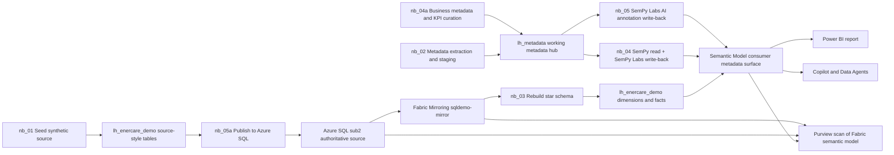

# Demo Explanation Guide

This guide is the current collaboration narrative for Fabric, Power BI, Azure SQL, and Purview.
It reflects the SemPy migration: SemPy plus SemPy Labs is now the primary semantic write-back path.

## One-Sentence Explanation

This demo seeds synthetic operational data, publishes that slice to Azure SQL as the authoritative
source, mirrors SQL into Fabric, rebuilds the star schema, then enriches the semantic model with
SemPy and SemPy Labs so Copilot, Data Agents, and Purview all consume governed metadata.

## Current Architecture

1. sub1 is the Fabric build plane.
2. sub2 is the Azure SQL authoritative source plane.
3. sub3 is the Purview catalog and governance plane.

## Architecture Diagram

## What Changed

1. Removed JDBC metadata dependency on SQL extended properties.
2. Removed TMDL REST editing as the primary write-back mechanism.
3. Promoted SemPy read and SemPy Labs write-back to the primary model.
4. Kept Purview scanning focused on Fabric semantic models.

## Notebook Roles

### nb_01_setup_demo_environment

Seeds synthetic operational data into lh_enercare_demo.

### nb_05a_publish_synthetic_data_to_sql

Publishes seven source tables into Azure SQL in sub2.

### nb_03_pbi_star_schema

Rebuilds the analytics star schema from mirrored SQL source.

### nb_02_metadata_pipeline_demo

Builds and refreshes working metadata in lh_metadata for technical and curated business context.

### nb_04a_extend_metadata_schema

Extends metadata schema and seeds certified KPI metadata plus AI metadata.

### nb_04_sempy_writeback

Now uses SemPy to inventory the semantic model and SemPy Labs to write table, column, and measure
descriptions plus AI instruction annotations.

### nb_05_push_qa_verified_answers

Builds the verified Q and A payload and writes PBI_AI_Instructions using SemPy Labs.

### nb_05b_test_sql_connectivity

Smoke test for private connectivity from Fabric to Azure SQL.

## Why SemPy Is Primary

1. It aligns with the design decision to read and write model metadata directly on the semantic model.
2. It avoids dependence on source SQL extended properties that are not populated in this environment.
3. It keeps metadata updates closer to the runtime consumer surface used by Copilot and Data Agents.
4. It supports the Purview model where scanned Fabric semantic models become catalog inputs.

## Metadata Lifecycle

1. Metadata is assembled and curated in lh_metadata.
2. SemPy reads current semantic model objects.
3. SemPy Labs writes curated metadata into the semantic model.
4. Purview scans semantic models and publishes governance inventory, glossary, and lineage.

## Collaboration Summary

1. SQL remains authoritative for source data.
2. Fabric remains the metadata engineering and runtime analytics surface.
3. SemPy plus SemPy Labs is the primary semantic write-back path.
4. Purview remains the published governance authority.

## Common Questions

### Why keep lh_metadata if SemPy writes directly to the model?

lh_metadata remains the workshop for curated metadata authoring and approvals.

### Why not keep TMDL REST mutation as primary?

The revised design explicitly promotes SemPy and SemPy Labs as the primary write-back mechanism.

### Is Purview already the system of record?

Purview is the intended published authority; Fabric-side metadata engineering is implemented first.
