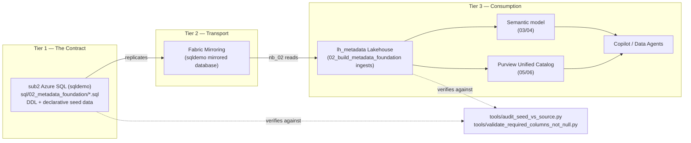
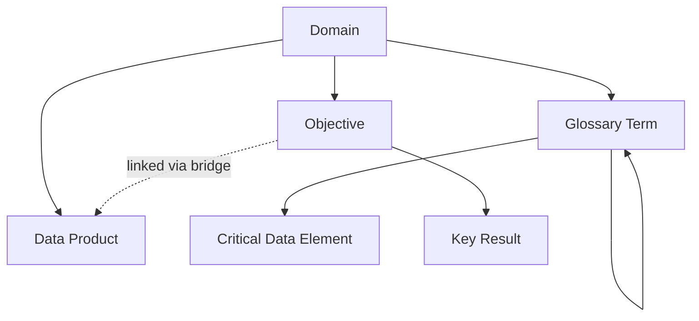
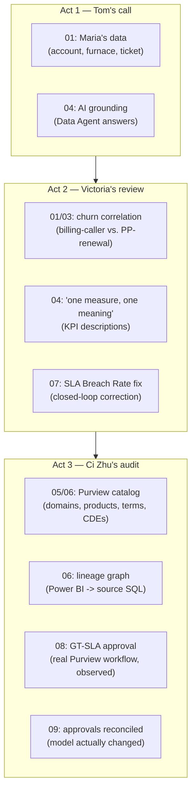

# The Governance Contract & Ontology Model — A Project Narrative

**Purpose of this document:** A living, descriptive narrative for explaining this demo's
conceptual foundation to fellow SEs — not a per-notebook reference (see
`docs/0N_Notebook_Description.md` for that), but the "why does this hang together" story:
the 3-tier data-contract design, the governance ontology it enforces, and how we prove — not
just claim — that the two stay in sync. Written to be extended as the project grows; treat new
phases of work as additions to this narrative, not replacements of it.

---

## 1. The story in one paragraph

This demo exists to answer a question every real governance program eventually has to answer
for real: *"How do you know your metadata is actually correct, not just present?"* Most
governance demos show you a nice-looking catalog UI and stop there. This one goes one layer
deeper — every governed object (a domain, a data product, a glossary term, a critical data
element, a business objective) is defined once, in version-controlled SQL, and then mechanically
verified — at the value level, not just "does the column exist" — everywhere that definition is
supposed to propagate to. When we found a real regression mid-build (steward assignments had
silently reverted to `NULL`), it wasn't a demo-breaking accident to cover up — it became the
proof that the verification layer works, and it's now a permanent, reusable part of the build.

## 2. The 3-tier data-contract design

Ask any SE "where does the truth live in this demo?" and the answer should be immediate and
unambiguous: **SQL is the governance contract.** Everything else is a downstream, verifiable
copy of it.

**Why this design, explained simply:**

- **Tier 1 (the contract) is SQL, not a notebook, not a UI.** The `.sql` files under
  `sql/02_metadata_foundation/` (schema DDL + declarative `DELETE`+`INSERT` seed scripts) are
  the single, human-readable, git-diffable statement of what the governance metadata is
  *supposed* to be. If you want to know "what should `DOM-CUSTOPS`'s steward be," the answer
  lives in one committed file, not scattered across notebook cells or tribal knowledge.
- **Tier 2 (transport) is Fabric Mirroring**, a near-real-time, low-maintenance replication
  layer. It's infrastructure, not logic — it has no opinion about what the data means, only
  that it gets copied faithfully and promptly.
- **Tier 3 (consumption) is everything that actually uses the metadata** — the Lakehouse
  tables notebooks read, the semantic model, Purview's catalog, and ultimately the AI surfaces
  (Copilot, Data Agents) that ground their answers in it.
- **The contract only means something if it's enforced.** A "contract" nobody checks is just a
  wish. That's what the audit tooling in Section 4 is for.

This is also why, when the steward-column regression was found, the fix was applied **at Tier
1** (backfilling the SQL source, then letting the existing pipeline propagate it correctly) —
not by teaching Tier 3's consumers to tolerate or paper over missing data. Patching a symptom at
the consumption tier would have silently broken the contract; fixing the source restores it.

## 3. The ontology: what's a governed entity, and how do they relate

Separately from the 3-tier *transport* design, there's a second, orthogonal concept worth being
precise about with an SE audience: the **ontology** — the actual graph of governed business
entities and the typed relationships between them. This is explicitly named in the repo's own
design history (`sql/02_metadata_foundation/11_ontology_okr_schema.sql`, closing gap "G11-1 —
formal ontology / typed relationships").

### The ontology dimension tables

These are the tables that hold descriptive "master data" about governed entities *and* their
place in the graph — the true ontology layer:

| Entity | Table | Relationship |
|---|---|---|
| **Governance Domain** | `domains` | Root entity (optionally self-hierarchical via `parent_domain`, unused in this demo's flat 3-domain design) |
| **Data Product** | `data_products` | Child of Domain (`parent_domain_id`) |
| **Glossary Term** | `glossary_terms` | Child of Domain (`domain_code`), self-referential parent hierarchy (`parent_term_code`) |
| **Critical Data Element (CDE)** | `cdes` | Child of Glossary Term (`parent_glossary_term`) |
| **Objective (OKR)** | `okrs` | Child of Domain (`domain_id`) — the business-outcome layer |
| **Key Result** | `okr_key_results` | Child of Objective (`okr_id`) |
| **OKR ↔ Data Product link** | `okr_data_products` | Bridge between Objective and the Data Product that measures it |

### What's *not* part of the ontology (and why that distinction matters)

It's worth being explicit with an SE audience about what these tables are **not**, because
conflating them muddies the "ontology" story:

- **`role_assignments` / `label_assignments`** — many-to-many *assignment/bridge* tables (who
  holds what role over what scope; which sensitivity label applies to which asset). They
  reference the ontology's entities but aren't entities or typed edges themselves.
- **`governance_change_requests`** — a *workflow/event ledger* (`Draft → PendingApproval →
  Approved → Applied`), transactional in nature. This is the audit trail *of changes to* the
  ontology, not the ontology itself.
- **`purview_phase_08_10_closeout` and the `purview_phase_08–11_*_validation` tables** —
  *computed validation output*, written at runtime by `08_validate_governance_evidence`. These
  are evidence artifacts *about* the ontology's health, generated fresh each run — not seeded,
  not part of the governance contract.

## 4. Phase addition: proving the contract holds (2026-08-18)

This is a new phase in the project's history, added when live validation of
`08_validate_governance_evidence` surfaced a real regression — and it's now a permanent part of
how this demo's build is verified, not a one-time fix.

### What happened

The stewardship scorecard (Cell 3 of notebook 08) failed with a Spark schema error pointing at
a missing `governance_domain_stewards` column. Tracing it back through the 3-tier design (not
guessing at the consumption tier) found the real fault at Tier 1: every steward column across
`governance_domains`/`governance_data_products`/`governance_cdes` had regressed to `NULL` at the
sub2 SQL source, and `governance_glossary_terms` separately still held 35 rows of stale legacy
placeholder content that had never actually been replaced by the current seed script. Fabric
Mirroring was also found paused, which is why neither fix propagated at first. Full narrative:
`docs/02_Notebook_Description.md`'s Follow-up section.

### What was built as a result

Rather than treat this as a one-off fix, it became a standing capability — a **governance-contract
compliance audit**, runnable any time, against either tier:

- **`tools/audit_seed_vs_source.py --target both`** — parses the declarative seed `.sql` files
  and checks, at both the sub2 source and the `lh_metadata` destination:
  1. **Value-level parity** — every column of every seeded row matches the committed `.sql`
     exactly (not just "is it non-null").
  2. **Row counts** — each table has exactly the count its seed script's own header declares.
  3. **Enum/allowed-value compliance** — constrained columns (`domain_type`, `product_type`,
     `expected_data_type`) only ever contain values the ingestion notebook's own validation
     would accept.
  4. **Referential integrity** — every typed edge in the ontology graph above resolves to a
     real parent row; zero orphans.
- **`tools/validate_required_columns_not_null.py --target both`** — checks that every column
  `02_build_metadata_foundation`'s own ingestion code declares "required" is actually non-null
  in practice (a real gap: the ingestion notebook's own check only asserts a column is
  *present*, not that every row's *value* is filled in).

### Current state (confirmed 2026-08-18)

Both tools report **0 failing checks**, across all categories, at both tiers. The governance
contract genuinely holds — not asserted, verified.

## 5. The 10-notebook build, end to end

Every one of the 10 notebooks has its own artifact catalog (`docs/0N_Notebook_Description.md`)
and its own demo digest (`docs/slides/nb_0N_demo_prep.md`). This section is the synthesis: one
continuous story of how the 3-tier contract and the ontology graph actually get built, phase by
phase, and why each notebook exists. Read this section when you need the "how does the whole
pipeline hang together" answer; go to the per-notebook docs when you need artifact-level detail.

### 5.0 Quick reference

| # | Notebook | Tier | Ontology / workflow footprint | One-line demo relevance |
|---|---|---|---|---|
| 01 | `01_setup_source_data` | **Creates Tier 1** | None (pure operational data — the substrate the ontology governs) | Every fact Tom/Victoria/Ci Zhu cites originates here, incl. the designed churn correlation |
| 02 | `02_build_metadata_foundation` | **Tier 3 ingestion** | Populates the **entire ontology dimension layer** (Domain, Data Product, Glossary Term, CDE, Objective, Key Result) | "One governed definition" becomes real, queryable data |
| 03 | `03_build_semantic_model` | Tier 3 (reshape only) | None | The single analytics foundation every KPI is calculated from |
| 04 | `04_writeback_governed_metadata` | Tier 3 (final propagation) | Propagates (doesn't create) ontology annotations onto the live model | "One measure, one meaning" becomes a technical fact, not a promise |
| 05 | `05_publish_governance_domains` | Tier 3 (Purview publish) | Publishes **Domain**, **Data Product**, **Objective**, **Key Result** as live Purview objects | The catalog structure Ci Zhu shows the auditor starts existing here |
| 06 | `06_publish_glossary_and_lineage` | Tier 3 (Purview publish) | Publishes **Glossary Term**, **CDE** + custom lineage edges | Every `GT-*`/`CDE-*` code becomes real and resolvable; powers the Act 3 lineage moment |
| 07 | `07_apply_approved_changes` | Tier 1 → Tier 3 bridge | **SQL-controlled workflow**: Draft → PendingApproval → Approved → Applied | "Click Approve → watch the data change," the SQL-controlled half of governance |
| 08 | `08_validate_governance_evidence` | Reads Tier 3; observes Purview directly | First **Purview-native** workflow observed (Term publish, `GT-SLA`) | Proves governance maturity with real data, not assertions |
| 09 | `09_reconcile_semantic_model` | Tier 3 | Reconciles 3 Purview-native decisions + 1 SQL-controlled promotion into the live model | Proves an approval actually changes what a report consumer sees |
| 10 | `10_reset_demo` | Tier 1 → Tier 3 reset | Resets SQL-controlled workflow state only; never touches Purview-native proofs | The operator utility that keeps the whole story repeatable |

### 5.1 Phase A — Foundation (01–04): data becomes governable

The first four notebooks build the substrate everything else governs. `01_setup_source_data`
writes the one and only copy of the operational truth — customers, contracts, billing, service
requests, and a full call-center interaction dataset with a deliberately-designed churn
correlation — directly as **Tier 1**, publishing it into the `sqldemo` Azure SQL contract that
Fabric Mirroring later replicates from. `02_build_metadata_foundation` is where the governance
ontology is actually born: every Domain, Data Product, Glossary Term, CDE, Objective, and Key
Result gets its one canonical row here, ingested from the Tier 1 contract via its Tier 2
mirrored copy — this notebook also reconciles that metadata against the live semantic model,
staging the exact annotation payload (`sm_annotations`) the writeback step needs.
`03_build_semantic_model` is the quiet workhorse: a pure reshape of Tier 1 data into a Power
BI-ready star schema, with no governance logic of its own — its only job is to guarantee every
downstream KPI is calculated from one consistent dimensional model. `04_writeback_governed_
metadata` closes Phase A by actually writing the governed descriptions, annotations, and
certified AI-grounding content onto the live semantic model, gated on certification the whole
way — this is the mechanism, not just the promise, behind "one measure, one meaning."

### 5.2 Phase B — Purview publication (05–06): governance becomes visible

`05_publish_governance_domains` and `06_publish_glossary_and_lineage` take everything Phase A
built inside Fabric's own working store and publish it as real, live objects in Microsoft
Purview's Unified Catalog — the moment governance stops being an internal Fabric concept and
becomes an externally visible, audit-ready catalog. `05` publishes the Domain/Data
Product/Objective/Key-Result layer; `06` publishes the Glossary Term/CDE layer plus the custom
cross-system lineage edges that native Purview scans alone can't establish. Together these two
notebooks are what let Ci Zhu open the Purview portal in Act 3 and show a real governed catalog,
not a mockup — and `06`'s lineage graph (Power BI visual → semantic model → lakehouse → mirrored
SQL → source SQL) is the single most visually compelling artifact the whole build produces.

### 5.3 Phase C — Closed-loop governance (07–10): approvals become real, provable, repeatable

The last four notebooks are where this demo goes further than a typical governance demo: instead
of just showing a catalog, they prove that *approvals actually change something*, using both of
this repo's two governance-workflow patterns side by side. `07_apply_approved_changes` is the
**SQL-controlled** pattern — a request moves `Draft → PendingApproval → Approved → Applied`
entirely inside the SQL ledger, and this notebook is the dispatcher that turns an Approved
decision into a real change in `lh_metadata` (a KPI re-certification, a new verified answer, an
AI-instruction rollback). `08_validate_governance_evidence` is the first appearance of the
**Purview-native** pattern — a real Term-publish workflow (`GT-SLA`), approved by a named
stakeholder inside the Purview portal, observed here only through the term's own `status` field
(since Purview exposes no workflow-request API — the governed object's own state is the
evidence). `09_reconcile_semantic_model` is the payoff: it takes three separately-approved
Purview-native decisions (`GT-SLA`, a Data Product access request, a Data Product publish) and
reconciles all of them into real semantic-model metadata, plus promotes one governed source
object into a brand-new KPI measure via a fourth, purely SQL-controlled gate — proving, side by
side, that both governance patterns this demo uses actually work end to end. `10_reset_demo`
closes the loop operationally: it resets every SQL-controlled demo decision back to its
pre-approval state so the whole story can be re-told indefinitely, while deliberately never
touching the three real Purview-native proofs — those stay proven, permanently.

## 6. A demo flow: mapping notebooks to the narrative acts

This is a structural map for slide/demo sequencing, not the full script (a separate
demo-design-walkthrough document will carry the line-by-line narrative). It shows which
notebook's artifacts back which moment in the Maria Castellanos story.

| Act | Notebooks in play | What to show | Core talking point |
|---|---|---|---|
| **Act 1 — Tom's call** | 01, 04 | Maria's real account/equipment/ticket data; the Data Agent answering a natural-language question mid-call | "One seeded dataset, one live call — every fact Tom reads is a real row." |
| **Act 2 — Victoria's review** | 01, 03, 04, 07 | The billing-caller/PP-renewal churn correlation on the dashboard; the SLA Breach Rate KPI correction | "The dashboard surfaced a real churn driver, and when we found a KPI needed correcting, the fix went through the same approval contract as everything else." |
| **Act 3 — Ci Zhu's audit** | 05, 06, 08, 09 | The Purview catalog; the lineage graph; the `GT-SLA` approval read back through the API; the semantic model carrying that approval's real content | "Here's who owns this, here's how it connects, here's the actual approval — and here's proof it changed what you're looking at." |

## 7. High-level talking points, notebook by notebook

A quotable one-liner per notebook, usable directly on a slide or as a verbal transition:

1. **01 — Setup source data:** "A full operational system, not a static dataset — and one churn
   signal baked in on purpose, enforced structurally so it can never silently regress."
2. **02 — Build metadata foundation:** "Every governed object gets exactly one row here — that's
   what makes 'one definition' a structural fact, not a policy statement."
3. **03 — Build semantic model:** "Mirrored SQL in, star schema out — one reshape step, so every
   KPI in the demo traces back to the same foundation."
4. **04 — Writeback governed metadata:** "Every description and annotation passed a
   certification gate before it touched the live model — and we read it back to verify it."
5. **05 — Publish governance domains:** "The same domains and data products a Purview admin
   would create by hand — published directly, with the business-objective layer on top."
6. **06 — Publish glossary and lineage:** "Native scans tell Purview an asset exists; this
   notebook tells Purview how assets connect across systems."
7. **07 — Apply approved changes:** "One dispatcher, several request types, one
   Draft→Approved→Applied contract — this is what makes the closed loop closed."
8. **08 — Validate governance evidence:** "This is what a real approval inside the Purview
   portal looks like once read back through the API — not a SQL-side approximation."
9. **09 — Reconcile semantic model:** "Rerun any of these phases and you get the same receipt,
   re-validated, not a new one fabricated — that's proof, not a claim."
10. **10 — Reset demo:** "An operator tool, not shown to an audience — it's what lets us redemo
    the same story tomorrow without touching a single real Purview approval."

## 8. Recommended slide flow

A suggested deck structure built from this narrative — sized for a technical SE audience, not a
line-by-line script:

1. **Title + the one-paragraph story** (Section 1) — "how do you know your metadata is actually
   correct, not just present?"
2. **The 3-tier contract diagram** (Section 2's mermaid) — SQL is the contract, everything else
   is a verified copy.
3. **The ontology graph diagram** (Section 3's mermaid) — what's an entity, what's a bridge,
   what's a ledger, what's computed output.
4. **The 10-notebook map** (Section 5.0's quick-reference table) — one slide, the whole build at
   a glance, phase-colored (Foundation / Purview Publication / Closed-loop Governance).
5. **Act 1 slide** — Maria's data + the Data Agent answer (notebooks 01, 04).
6. **Act 2 slide** — the churn correlation + the SLA Breach Rate correction (notebooks 01/03/04,
   07).
7. **Act 3 slide(s)** — the Purview catalog, the lineage graph, the `GT-SLA` approval and its
   reconciliation into the model (notebooks 05, 06, 08, 09).
8. **"We proved the contract holds" slide** (Section 4) — the governance-contract audit tooling
   and its 0-failing-checks result; the steward-regression story as evidence the verification
   layer works, not something to hide.
9. **Closing slide** — the two governance-workflow patterns side by side (SQL-controlled vs.
   Purview-native) and the repeatability guarantee (`10_reset_demo`).

## 9. High-level takeaways (the "so what")

- **SQL is the contract, and we can prove it holds** — not just claim it. The audit tooling
  (Section 4) checks value-level parity, row counts, enum compliance, and referential integrity,
  at both the source and the destination, any time.
- **The ontology is a real, resolvable graph**, not decorative metadata — every Domain/Data
  Product/Glossary Term/CDE/Objective/Key Result relationship resolves, and the demo can show
  that resolution live.
- **Two governance-workflow patterns, proven side by side** — SQL-controlled (Draft→Approved→
  Applied, notebook 07) and Purview-native (Term/Data-Product workflows, notebooks 08/09) — and
  the honest handling of the one place Purview genuinely can't be machine-verified (Data Product
  access decisions).
- **Approvals provably change what a consumer sees** — notebook 09's reconciliation isn't a
  SQL-side simulation; it's real semantic-model metadata a report author can open and read.
- **The whole story is repeatable, not a one-time performance** — notebook 10 resets every
  SQL-controlled demo decision without ever touching the three real, one-time-proven Purview
  approvals.

## 10. Where this narrative goes next

This document is meant to grow. As later phases add more of the ontology (a domain hierarchy
demo using the still-unused `parent_domain` field, additional OKR scenarios, a second Purview
region, etc.) or extend the compliance tooling (type-level DDL checks, gate-ledger consistency
checks), add a new numbered section here rather than starting a separate document — the goal is
one coherent story an SE can read start to finish, not a scattered set of point-in-time notes.
A separate demo-design-walkthrough document (not yet created) will carry the line-by-line demo
script; this document stays the conceptual/architectural narrative underneath it.

---

See also: [`docs/sql-prep-catalog.md`](./sql-prep-catalog.md) (per-script artifact index) ·
[`docs/closed-loop-governance-reference-model.md`](./closed-loop-governance-reference-model.md)
(native-scan/workflow architecture decision) ·
[`docs/08_Notebook_Description.md`](./08_Notebook_Description.md) ·
[`docs/02_Notebook_Description.md`](./02_Notebook_Description.md) (regression details) ·
[`docs/slides/`](./slides/) (per-notebook demo-prep digests, `nb_01_demo_prep.md`–`nb_10_demo_prep.md`) ·
[`docs/purview-maria-north-star-scenario.md`](./purview-maria-north-star-scenario.md)
