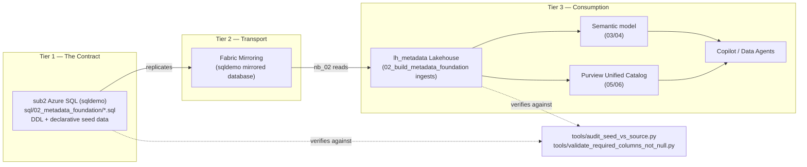
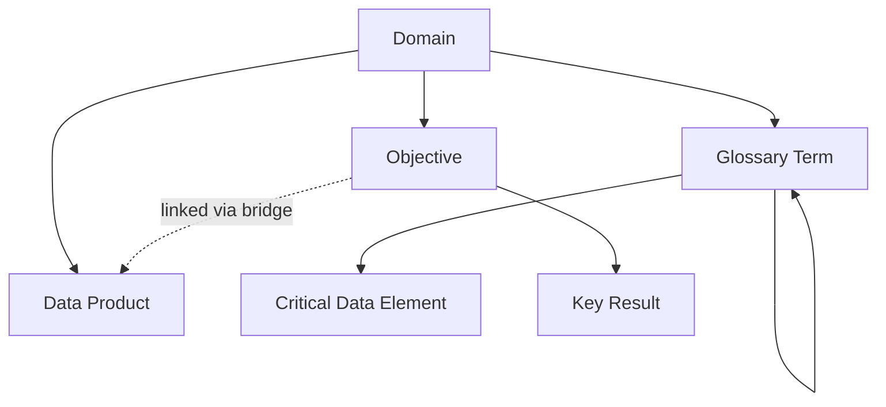

# The Governance Contract & Ontology Model — A Project Narrative

**Purpose of this document:** A living, descriptive narrative for explaining this demo's
conceptual foundation to fellow SEs — not a per-notebook reference (see
`docs/0N_Notebook_Description.md` for that), but the "why does this hang together" story:
the 3-tier data-contract design, the governance ontology it enforces, and how we prove — not
just claim — that the two stay in sync. Written to be extended as the project grows; treat new
phases of work as additions to this narrative, not replacements of it.

---

## 1. The story in one paragraph

This demo exists to answer a question every real governance program eventually has to answer
for real: *"How do you know your metadata is actually correct, not just present?"* Most
governance demos show you a nice-looking catalog UI and stop there. This one goes one layer
deeper — every governed object (a domain, a data product, a glossary term, a critical data
element, a business objective) is defined once, in version-controlled SQL, and then mechanically
verified — at the value level, not just "does the column exist" — everywhere that definition is
supposed to propagate to. When we found a real regression mid-build (steward assignments had
silently reverted to `NULL`), it wasn't a demo-breaking accident to cover up — it became the
proof that the verification layer works, and it's now a permanent, reusable part of the build.

## 2. The 3-tier data-contract design

Ask any SE "where does the truth live in this demo?" and the answer should be immediate and
unambiguous: **SQL is the governance contract.** Everything else is a downstream, verifiable
copy of it.

**Why this design, explained simply:**

- **Tier 1 (the contract) is SQL, not a notebook, not a UI.** The `.sql` files under
  `sql/02_metadata_foundation/` (schema DDL + declarative `DELETE`+`INSERT` seed scripts) are
  the single, human-readable, git-diffable statement of what the governance metadata is
  *supposed* to be. If you want to know "what should `DOM-CUSTOPS`'s steward be," the answer
  lives in one committed file, not scattered across notebook cells or tribal knowledge.
- **Tier 2 (transport) is Fabric Mirroring**, a near-real-time, low-maintenance replication
  layer. It's infrastructure, not logic — it has no opinion about what the data means, only
  that it gets copied faithfully and promptly.
- **Tier 3 (consumption) is everything that actually uses the metadata** — the Lakehouse
  tables notebooks read, the semantic model, Purview's catalog, and ultimately the AI surfaces
  (Copilot, Data Agents) that ground their answers in it.
- **The contract only means something if it's enforced.** A "contract" nobody checks is just a
  wish. That's what the audit tooling in Section 4 is for.

This is also why, when the steward-column regression was found, the fix was applied **at Tier
1** (backfilling the SQL source, then letting the existing pipeline propagate it correctly) —
not by teaching Tier 3's consumers to tolerate or paper over missing data. Patching a symptom at
the consumption tier would have silently broken the contract; fixing the source restores it.

## 3. The ontology: what's a governed entity, and how do they relate

Separately from the 3-tier *transport* design, there's a second, orthogonal concept worth being
precise about with an SE audience: the **ontology** — the actual graph of governed business
entities and the typed relationships between them. This is explicitly named in the repo's own
design history (`sql/02_metadata_foundation/11_ontology_okr_schema.sql`, closing gap "G11-1 —
formal ontology / typed relationships").

### The ontology dimension tables

These are the tables that hold descriptive "master data" about governed entities *and* their
place in the graph — the true ontology layer:

| Entity | Table | Relationship |
|---|---|---|
| **Governance Domain** | `domains` | Root entity (optionally self-hierarchical via `parent_domain`, unused in this demo's flat 3-domain design) |
| **Data Product** | `data_products` | Child of Domain (`parent_domain_id`) |
| **Glossary Term** | `glossary_terms` | Child of Domain (`domain_code`), self-referential parent hierarchy (`parent_term_code`) |
| **Critical Data Element (CDE)** | `cdes` | Child of Glossary Term (`parent_glossary_term`) |
| **Objective (OKR)** | `okrs` | Child of Domain (`domain_id`) — the business-outcome layer |
| **Key Result** | `okr_key_results` | Child of Objective (`okr_id`) |
| **OKR ↔ Data Product link** | `okr_data_products` | Bridge between Objective and the Data Product that measures it |

### What's *not* part of the ontology (and why that distinction matters)

It's worth being explicit with an SE audience about what these tables are **not**, because
conflating them muddies the "ontology" story:

- **`role_assignments` / `label_assignments`** — many-to-many *assignment/bridge* tables (who
  holds what role over what scope; which sensitivity label applies to which asset). They
  reference the ontology's entities but aren't entities or typed edges themselves.
- **`governance_change_requests`** — a *workflow/event ledger* (`Draft → PendingApproval →
  Approved → Applied`), transactional in nature. This is the audit trail *of changes to* the
  ontology, not the ontology itself.
- **`purview_phase_08_10_closeout` and the `purview_phase_08–11_*_validation` tables** —
  *computed validation output*, written at runtime by `08_validate_governance_evidence`. These
  are evidence artifacts *about* the ontology's health, generated fresh each run — not seeded,
  not part of the governance contract.

## 4. Phase addition: proving the contract holds (2026-08-18)

This is a new phase in the project's history, added when live validation of
`08_validate_governance_evidence` surfaced a real regression — and it's now a permanent part of
how this demo's build is verified, not a one-time fix.

### What happened

The stewardship scorecard (Cell 3 of notebook 08) failed with a Spark schema error pointing at
a missing `governance_domain_stewards` column. Tracing it back through the 3-tier design (not
guessing at the consumption tier) found the real fault at Tier 1: every steward column across
`governance_domains`/`governance_data_products`/`governance_cdes` had regressed to `NULL` at the
sub2 SQL source, and `governance_glossary_terms` separately still held 35 rows of stale legacy
placeholder content that had never actually been replaced by the current seed script. Fabric
Mirroring was also found paused, which is why neither fix propagated at first. Full narrative:
`docs/02_Notebook_Description.md`'s Follow-up section.

### What was built as a result

Rather than treat this as a one-off fix, it became a standing capability — a **governance-contract
compliance audit**, runnable any time, against either tier:

- **`tools/audit_seed_vs_source.py --target both`** — parses the declarative seed `.sql` files
  and checks, at both the sub2 source and the `lh_metadata` destination:
  1. **Value-level parity** — every column of every seeded row matches the committed `.sql`
     exactly (not just "is it non-null").
  2. **Row counts** — each table has exactly the count its seed script's own header declares.
  3. **Enum/allowed-value compliance** — constrained columns (`domain_type`, `product_type`,
     `expected_data_type`) only ever contain values the ingestion notebook's own validation
     would accept.
  4. **Referential integrity** — every typed edge in the ontology graph above resolves to a
     real parent row; zero orphans.
- **`tools/validate_required_columns_not_null.py --target both`** — checks that every column
  `02_build_metadata_foundation`'s own ingestion code declares "required" is actually non-null
  in practice (a real gap: the ingestion notebook's own check only asserts a column is
  *present*, not that every row's *value* is filled in).

### Current state (confirmed 2026-08-18)

Both tools report **0 failing checks**, across all categories, at both tiers. The governance
contract genuinely holds — not asserted, verified.

## 5. Where this narrative goes next

This document is meant to grow. As later phases add more of the ontology (a domain hierarchy
demo using the still-unused `parent_domain` field, additional OKR scenarios, a second Purview
region, etc.) or extend the compliance tooling (type-level DDL checks, gate-ledger consistency
checks), add a new numbered section here rather than starting a separate document — the goal is
one coherent story an SE can read start to finish, not a scattered set of point-in-time notes.

---

See also: [`docs/sql-prep-catalog.md`](./sql-prep-catalog.md) (per-script artifact index) ·
[`docs/closed-loop-governance-reference-model.md`](./closed-loop-governance-reference-model.md)
(native-scan/workflow architecture decision) ·
[`docs/08_Notebook_Description.md`](./08_Notebook_Description.md) ·
[`docs/02_Notebook_Description.md`](./02_Notebook_Description.md) (regression details) ·
[`docs/purview-maria-north-star-scenario.md`](./purview-maria-north-star-scenario.md)
